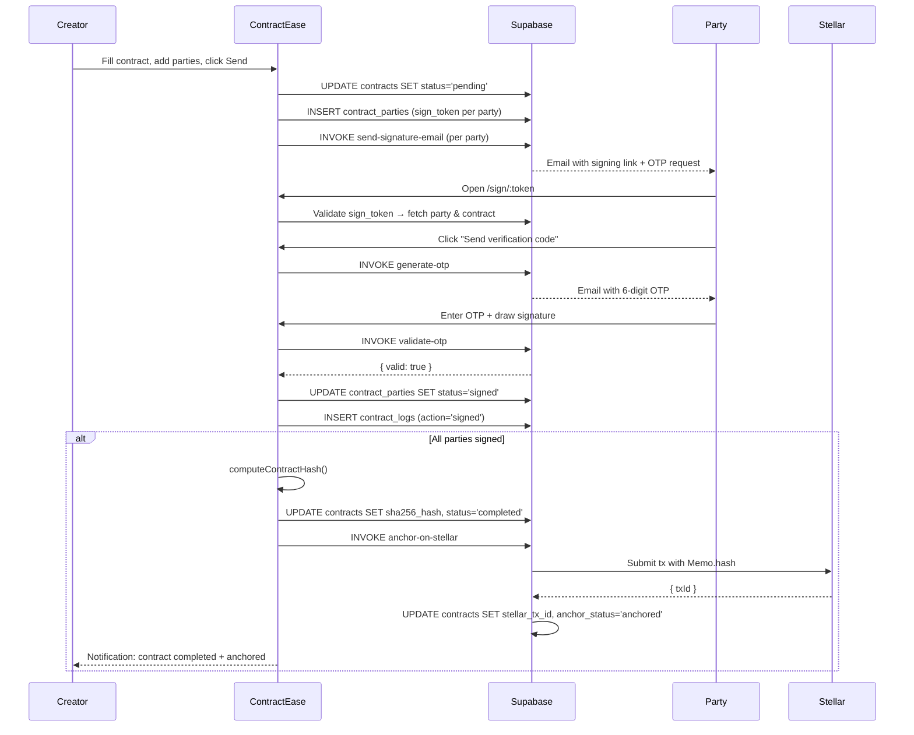

# Contract Signing Lifecycle

This document covers the complete lifecycle of a contract — from creation through signing, anchoring, and failure handling. Every state transition is logged to `contract_logs` for an immutable audit trail.

---

## State Machine

```
                    ┌────────┐
                    │ DRAFT  │ ─── creator edits, adds parties
                    └────┬───┘
                         │ sendForSigning()
                    ┌────▼────┐
                    │ PENDING │ ─── all parties notified, awaiting signatures
                    └────┬────┘
                         │ first party signs
                   ┌─────▼──────┐
                   │  PARTIAL   │ ─── some parties signed, others pending
                   └─────┬──────┘
          ┌──────────────┼──────────────┐
          │              │              │
    all signed      party rejects    anchor fails
          │              │              │
    ┌─────▼────┐   ┌─────▼────┐  ┌─────▼────┐
    │COMPLETED │   │CANCELLED │  │  FAILED  │
    └──────────┘   └──────────┘  └──────────┘
```

**Status transitions:**

| From | To | Trigger |
|---|---|---|
| `draft` | `pending` | Creator sends contract for signing |
| `pending` | `partial` | First party signs |
| `partial` | `completed` | Last required party signs + anchor succeeds |
| `pending` / `partial` | `cancelled` | Any party rejects, or creator cancels |
| `partial` | `failed` | Stellar anchor fails after all parties sign |
| `draft` | `cancelled` | Creator discards contract |

---

## Sequence Diagram



---

## Step-by-Step Implementation

### Step 1: Send Contract for Signing

```typescript
// src/hooks/useContracts.ts
async function sendForSigning(contractId: string, parties: NewParty[]) {
  // 1. Generate sign tokens for each party
  const partyInserts = parties.map(p => ({
    contract_id: contractId,
    organization_id: orgId,
    email: p.email,
    full_name: p.name,
    role: p.role,
    status: 'pending',
    sign_token: crypto.randomUUID(),
    token_expires_at: new Date(Date.now() + 7 * 24 * 60 * 60 * 1000).toISOString(),
  }))

  const { data: insertedParties, error } = await supabase
    .from('contract_parties')
    .insert(partyInserts)
    .select()

  if (error) throw error

  // 2. Update contract status
  await supabase.from('contracts')
    .update({ status: 'pending', updated_at: new Date().toISOString() })
    .eq('id', contractId)

  // 3. Send invitation emails via Edge Function
  await Promise.all(insertedParties.map(party =>
    supabase.functions.invoke('send-signature-email', {
      body: {
        contractId,
        contractTitle: contract.title,
        partyId: party.id,
        partyEmail: party.email,
        partyName: party.full_name,
        signToken: party.sign_token,
        senderName: currentUser.full_name,
      },
    })
  ))

  // 4. Log the action
  await supabase.from('contract_logs').insert({
    contract_id: contractId,
    actor_id: currentUser.id,
    actor_email: currentUser.email,
    action: 'sent',
    metadata: { party_count: parties.length },
  })
}
```

### Step 2: Public Signing Page Token Validation

The `/sign/:token` route is public (no auth required). It validates the token server-side.

```typescript
// src/pages/PublicSign.tsx
const { token } = useParams<{ token: string }>()

useEffect(() => {
  async function validateToken() {
    // Query contract_parties by sign_token
    // This query works without auth because sign_token acts as a bearer token
    // RLS on contract_parties must allow anon select by sign_token
    const { data: party, error } = await supabase
      .from('contract_parties')
      .select(`
        id, email, full_name, role, status,
        token_expires_at,
        contracts (
          id, title, content, status,
          contract_parties (email, full_name, role, status)
        )
      `)
      .eq('sign_token', token)
      .single()

    if (error || !party) {
      setError('Invalid or expired signing link.')
      return
    }

    if (new Date(party.token_expires_at!) < new Date()) {
      setError('This signing link has expired. Please request a new one.')
      return
    }

    if (party.status === 'signed') {
      setAlreadySigned(true)
      return
    }

    setParty(party)
    setContract(party.contracts)
  }
  validateToken()
}, [token])
```

### Step 3: OTP Generation and Delivery

```typescript
// Edge Function: supabase/functions/generate-otp/index.ts
Deno.serve(async (req) => {
  const { email, contractId, partyId } = await req.json()

  // Generate 6-digit code
  const code = Math.floor(100000 + Math.random() * 900000).toString()

  // Hash before storage
  const salt = Deno.env.get('OTP_SALT')!
  const encoder = new TextEncoder()
  const data = encoder.encode(code + salt)
  const hashBuffer = await crypto.subtle.digest('SHA-256', data)
  const codeHash = Array.from(new Uint8Array(hashBuffer))
    .map(b => b.toString(16).padStart(2, '0')).join('')

  // Invalidate previous OTPs for this party
  await supabaseAdmin.from('otps')
    .update({ used: true })
    .eq('party_id', partyId)
    .eq('used', false)

  // Store hashed OTP
  await supabaseAdmin.from('otps').insert({
    email,
    code: codeHash,
    contract_id: contractId,
    party_id: partyId,
    expires_at: new Date(Date.now() + 15 * 60 * 1000).toISOString(),
  })

  // Send email via Resend
  await fetch('https://api.resend.com/emails', {
    method: 'POST',
    headers: {
      'Authorization': `Bearer ${Deno.env.get('RESEND_API_KEY')}`,
      'Content-Type': 'application/json',
    },
    body: JSON.stringify({
      from: 'ContractEase <sign@contractease.app>',
      to: email,
      subject: 'Your signing verification code',
      html: `<p>Your verification code is: <strong>${code}</strong></p><p>Expires in 15 minutes.</p>`,
    }),
  })

  return new Response(JSON.stringify({ sent: true }))
})
```

### Step 4: Signature Capture

ContractEase supports three signature capture methods on the signing page:

```typescript
// src/components/signing/SignatureCanvas.tsx
// Method 1: Draw (canvas)
const canvasRef = useRef<HTMLCanvasElement>(null)
// Implements mouse/touch draw → canvas.toDataURL('image/png') → base64

// Method 2: Type (font)
const SIGNATURE_FONTS = ['Dancing Script', 'Pacifico', 'Great Vibes']
// Renders name in selected font → canvas.toDataURL() → base64

// Method 3: Upload (image file)
const handleFileUpload = (file: File) => {
  const reader = new FileReader()
  reader.onload = (e) => setSignatureData(e.target?.result as string)
  reader.readAsDataURL(file)
}

// Method 4: Freighter (handled by FreighterSign component)
```

### Step 5: Post-Signing Check and Anchoring

```typescript
// Called after updating a party's status to 'signed'
async function checkAndAnchor(contractId: string) {
  // Fetch all parties
  const { data: parties } = await supabase
    .from('contract_parties')
    .select('status, role')
    .eq('contract_id', contractId)

  const signers = parties!.filter(p => p.role === 'signer')
  const allSigned = signers.every(p => p.status === 'signed')

  if (!allSigned) {
    // Update to 'partial' if at least one signed
    const anySigned = signers.some(p => p.status === 'signed')
    if (anySigned) {
      await supabase.from('contracts')
        .update({ status: 'partial' })
        .eq('id', contractId)
    }
    return
  }

  // All signers signed — compute hash and anchor
  const { data: fullContract } = await supabase
    .from('contracts')
    .select('*, contract_parties(*)')
    .eq('id', contractId)
    .single()

  const hash = await computeContractHash({
    id: fullContract!.id,
    title: fullContract!.title,
    content: fullContract!.content ?? '',
    parties: fullContract!.contract_parties,
    created_at: fullContract!.created_at,
  })

  // Update status and hash
  await supabase.from('contracts').update({
    status: 'completed',
    sha256_hash: hash,
    updated_at: new Date().toISOString(),
  }).eq('id', contractId)

  // Trigger anchoring
  try {
    const { data: anchorResult } = await supabase.functions.invoke('anchor-on-stellar', {
      body: { contractId, sha256Hash: hash, network: 'testnet' },
    })

    await supabase.from('contract_logs').insert({
      contract_id: contractId,
      action: 'anchored',
      metadata: {
        stellar_tx_id: anchorResult.txId,
        explorer_url: anchorResult.explorerUrl,
      },
    })
  } catch (err) {
    await supabase.from('contracts')
      .update({ anchor_status: 'failed' })
      .eq('id', contractId)

    await supabase.from('contract_logs').insert({
      contract_id: contractId,
      action: 'anchor_failed',
      metadata: { error: err.message },
    })
  }
}
```

---

## Failure Handling

| Failure Scenario | Handling |
|---|---|
| Expired signing link | Show "link expired" message; allow party to request new link |
| Invalid OTP | Show error, allow retry (max 5 attempts before lockout) |
| Party rejects contract | Set party status `rejected`, contract status `cancelled`, notify creator |
| Stellar anchor fails | Set `anchor_status = 'failed'`; retry button in dashboard; contract still `completed` |
| All parties didn't sign within deadline | Scheduled Edge Function marks contract `cancelled` after configurable days |
| Email delivery failure | Supabase logs Edge Function error; manual resend available in UI |

---

## Audit Log Actions

Every significant event produces a `contract_logs` row:

| Action | Triggered By |
|---|---|
| `created` | Creator saves draft |
| `sent` | Creator sends for signing |
| `viewed` | Party opens signing page |
| `otp_sent` | OTP email delivered |
| `otp_verified` | Party enters correct OTP |
| `signed` | Party completes signature capture |
| `rejected` | Party clicks "Reject" |
| `cancelled` | Creator or system cancels |
| `anchored` | Stellar tx confirmed |
| `anchor_failed` | Horizon API error |
| `anchor_retried` | Manual retry from dashboard |
