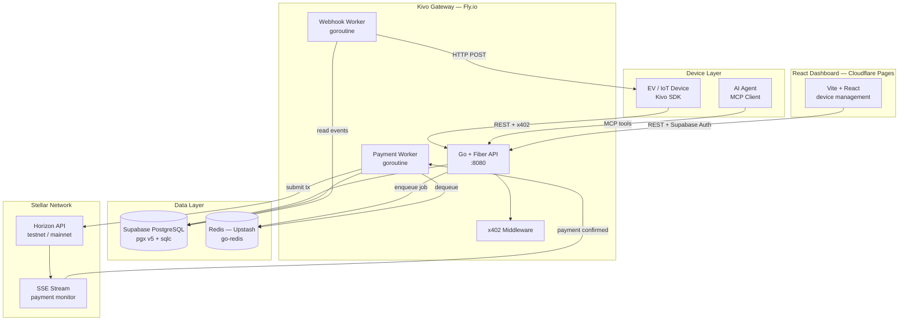

# Architecture & ADRs

This document records the six key architectural decisions that shaped Kivo Pay, explains the overall system design, and provides the canonical Go project structure.

---

## System Architecture Diagram



---

## Go Project Structure

```
apps/kivo/
├── cmd/
│   └── server/
│       └── main.go              # Entry point: Fiber app, routes, workers
├── internal/
│   ├── db/
│   │   ├── db.go                # sqlc generated DB interface
│   │   ├── models.go            # sqlc generated Go structs
│   │   ├── devices.sql.go       # sqlc generated device queries
│   │   ├── payments.sql.go      # sqlc generated payment queries
│   │   └── webhooks.sql.go      # sqlc generated webhook queries
│   ├── handlers/
│   │   ├── devices.go           # POST /v1/devices, GET /v1/devices/:id
│   │   ├── payments.go          # POST /v1/payments, GET /v1/payments/:id
│   │   └── webhooks.go          # POST /v1/webhooks
│   ├── middleware/
│   │   ├── auth.go              # API key + JWT verification
│   │   └── x402.go             # HTTP 402 payment middleware
│   ├── stellar/
│   │   ├── client.go            # Horizon client setup + failover
│   │   ├── wallet.go            # Keypair generation + encryption
│   │   └── payment.go           # Transaction building + submission
│   ├── workers/
│   │   ├── payment_worker.go    # Redis consumer: submit Stellar tx
│   │   └── webhook_worker.go    # Redis consumer: fire webhooks
│   ├── mcp/
│   │   ├── server.go            # MCP server registration
│   │   └── tools.go             # Tool handlers (create_payment, etc.)
│   └── config/
│       └── config.go            # Environment config via os.Getenv
├── queries/
│   ├── devices.sql              # Raw SQL for sqlc
│   ├── payments.sql             # Raw SQL for sqlc
│   └── webhooks.sql             # Raw SQL for sqlc
├── migrations/
│   ├── 001_create_devices.sql
│   ├── 002_create_payments.sql
│   └── 003_create_webhooks.sql
├── sqlc.yaml                    # sqlc configuration
├── go.mod
├── go.sum
├── Dockerfile
└── fly.toml
```

---

## ADR-001: Go + Fiber over Node.js / Next.js

**Status:** Accepted

**Context:**

Kivo Pay is an M2M payment gateway. Unlike a typical web app, it is designed to handle requests from thousands of autonomous devices simultaneously. A single EV charging station network could have 10,000 chargers all sending payment confirmations within a 5-minute window. The gateway must sustain high throughput with low latency and minimal resource consumption. The team also maintains Go codebases for other infrastructure tools and is proficient in the language.

**Decision:**

Use Go with the Fiber web framework as the backend runtime.

**Rationale:**

| Metric | Go + Fiber | Node.js / Express | Next.js API Routes |
|---|---|---|---|
| Throughput (req/s) | 100,000+ | 10,000–30,000 | 5,000–15,000 |
| Memory per instance | ~10 MB | 100–300 MB | 150–400 MB |
| Cold start | ~5 ms | 200–500 ms | 500 ms–2 s |
| Concurrency model | goroutines (M:N) | event loop (single-threaded) | event loop |
| Binary deploy | single static binary | node_modules/ | node_modules/ |
| Type safety | compile-time | runtime (TypeScript partial) | runtime |

Goroutines are extremely cheap (2 KB stack, grows on demand) — the gateway can maintain 100,000 concurrent device connections in a single instance. Node.js's event loop would require careful async management and would still be memory-bound. A single Go binary is deployed to Fly.io with no dependency installation step, making cold starts near-instant.

**Alternatives Rejected:**

- **Node.js + Fastify:** Familiarity but insufficient throughput for M2M scale.
- **Rust + Axum:** Maximum performance, but higher development cost for business logic. Reserved as a future optimization for the hot payment-submission path.
- **Python + FastAPI:** Unacceptable for high-throughput concurrent workloads.
- **Next.js API Routes:** Not designed for long-running goroutine workers or SSE connections.

**Consequences:**

The team must write Go for all gateway logic. The React dashboard communicates with the Go API via REST. Shared types must be maintained in both Go (backend) and TypeScript (frontend).

---

## ADR-002: sqlc over GORM / Bun

**Status:** Accepted

**Context:**

The gateway needs type-safe database access. The two common ORM choices in Go are GORM (reflection-based, popular) and Bun (faster, also reflection-based). Both generate queries at runtime via reflection, which introduces overhead and makes it difficult to validate queries at compile time.

**Decision:**

Use `sqlc` — a tool that generates type-safe Go code from raw SQL queries at compile time.

**Rationale:**

- **Zero reflection:** Generated code is plain Go structs with no `interface{}` anywhere.
- **Compile-time safety:** If a SQL query references a column that doesn't exist, `sqlc generate` fails. No runtime surprises.
- **Raw SQL performance:** Queries are exactly what you write — no ORM translation layer.
- **pgx compatibility:** sqlc has a first-class pgx driver, which pairs perfectly with ADR-003.
- **Readable queries:** SQL lives in `.sql` files, making database logic easy to audit.

Example: writing a query in `queries/payments.sql`:

```sql
-- name: GetPaymentByID :one
SELECT
    p.id,
    p.from_device_id,
    p.to_device_id,
    p.amount,
    p.asset_code,
    p.condition_type,
    p.status,
    p.stellar_hash,
    p.timeout_at,
    p.created_at,
    p.confirmed_at
FROM payments p
WHERE p.id = $1;
```

sqlc generates:

```go
// GetPaymentByID returns a single payment row.
func (q *Queries) GetPaymentByID(ctx context.Context, id uuid.UUID) (Payment, error) {
    row := q.db.QueryRow(ctx, getPaymentByID, id)
    var i Payment
    err := row.Scan(
        &i.ID, &i.FromDeviceID, &i.ToDeviceID,
        &i.Amount, &i.AssetCode, &i.ConditionType,
        &i.Status, &i.StellarHash, &i.TimeoutAt,
        &i.CreatedAt, &i.ConfirmedAt,
    )
    return i, err
}
```

**Alternatives Rejected:**

- **GORM:** Reflection-based, hides SQL, performance overhead on bulk queries, complex eager loading bugs.
- **Bun:** Better than GORM but still reflection-based; less ecosystem support for pgx v5.
- **database/sql raw:** More verbose than sqlc with no type generation benefit.

**Consequences:**

All database queries must be written as raw SQL in `.sql` files and regenerated with `sqlc generate` before use. This is a workflow discipline requirement but a net positive for code quality and performance.

---

## ADR-003: pgx over database/sql

**Status:** Accepted

**Context:**

Go's standard library provides `database/sql`, a generic database interface compatible with any SQL database. While portable, it is not optimized for PostgreSQL specifically. pgx is a PostgreSQL-only driver that bypasses `database/sql` for maximum performance.

**Decision:**

Use `github.com/jackc/pgx/v5` directly (not via `database/sql` wrapper) with `pgxpool` for connection pooling.

**Rationale:**

- **Fastest PostgreSQL driver for Go:** pgx uses the PostgreSQL binary wire protocol directly, avoiding the text encoding overhead of `database/sql`.
- **pgxpool:** Built-in connection pool with health checks, max connections, and idle timeout configuration.
- **Native PostgreSQL types:** UUID, JSONB, arrays, TIMESTAMPTZ — all handled natively without string parsing.
- **Prepared statements:** pgx caches prepared statements per connection automatically.
- **sqlc compatibility:** sqlc's pgx driver generates code that uses `pgx.Rows` and `pgxpool.Pool` directly.

```go
// internal/config/config.go
func NewPool(ctx context.Context) (*pgxpool.Pool, error) {
    cfg, err := pgxpool.ParseConfig(os.Getenv("DATABASE_URL"))
    if err != nil {
        return nil, err
    }
    cfg.MaxConns = 25
    cfg.MinConns = 5
    cfg.MaxConnIdleTime = 5 * time.Minute
    return pgxpool.NewWithConfig(ctx, cfg)
}
```

**Alternatives Rejected:**

- **database/sql + lib/pq:** Standard but slower text protocol, no native type support.
- **database/sql + pgx wrapper:** Loses pgx performance advantages through the generic interface.

**Consequences:**

Code is PostgreSQL-specific and cannot be trivially ported to MySQL or SQLite. This is an accepted trade-off given Supabase PostgreSQL is the declared database (ADR-004).

---

## ADR-004: Supabase PostgreSQL

**Status:** Accepted

**Context:**

Kivo Pay needs a managed PostgreSQL database with RLS (Row Level Security) for device isolation, a connection pool, and free-tier availability for the bootstrapping phase. The SGR platform already uses Supabase for ContractEase and SocialPay.

**Decision:**

Use Supabase PostgreSQL as the primary database, connected via direct pgx connection string (not the Supabase JS client).

**Rationale:**

- **Platform consistency:** All three SGR products (ContractEase, SocialPay, Kivo) share Supabase. Operational knowledge, billing, and RLS patterns are reused.
- **RLS for device isolation:** Supabase RLS policies enforce that a device owner can only read their own devices and payments — no application-layer filtering required.
- **Direct pgx connection:** The Go backend connects with a `postgresql://` connection string directly to the Supabase Postgres instance, bypassing the Supabase JS client overhead entirely.
- **Free tier:** 500 MB storage, 2 CPU, shared — sufficient for the MVP with thousands of devices.
- **Supabase Auth reuse:** Dashboard users authenticate via Supabase Auth (magic link). The Go API verifies the JWT using the Supabase public key, same pattern as ContractEase.

**Alternatives Rejected:**

- **PlanetScale / Neon:** Different platform from existing SGR infrastructure; no RLS.
- **Self-hosted PostgreSQL on Fly.io:** Adds ops burden; backup and HA management complexity.
- **CockroachDB:** Distributed but incompatible with some PostgreSQL extensions; higher cost.

**Consequences:**

The 500 MB free tier will be exhausted at approximately 1 million payment records. Migration path: upgrade Supabase plan ($25/month for 8 GB) or migrate to self-hosted Supabase on Fly.io volumes.

---

## ADR-005: Redis (Upstash) for Job Queue

**Status:** Accepted

**Context:**

Payment processing involves asynchronous steps: submitting a Stellar transaction (network latency), waiting for confirmation via SSE stream (up to 10 seconds), and firing webhooks (external HTTP calls that may fail and need retry). These cannot block the HTTP request that created the payment.

**Decision:**

Use Redis (Upstash managed) with `go-redis` as the async job queue. Goroutine workers consume jobs from Redis lists.

**Rationale:**

- **Upstash free tier:** 10,000 commands/day — sufficient for MVP payment volume (a payment requires ~5 Redis commands).
- **Simple primitives:** Redis `LPUSH` / `BRPOP` is sufficient for a basic job queue without a full message broker.
- **go-redis client:** Mature, high-performance, works with Upstash TLS URL out of the box.
- **goroutine workers:** Payment and webhook workers are plain goroutines started in `main.go` — no external process management needed.
- **Upstash HTTP fallback:** Upstash also provides an HTTP API for Redis, useful if TLS networking is restricted.

```go
// internal/workers/payment_worker.go
func StartPaymentWorker(ctx context.Context, rdb *redis.Client, q *db.Queries, sc *stellar.Client) {
    for {
        result, err := rdb.BRPop(ctx, 5*time.Second, "payment_jobs").Result()
        if err == redis.Nil {
            continue
        }
        if err != nil {
            log.Printf("worker: redis error: %v", err)
            continue
        }
        go processPaymentJob(ctx, result[1], q, sc)
    }
}
```

**Alternatives Rejected:**

- **RabbitMQ:** More powerful (exchanges, dead letter queues, acks) but requires managed hosting. Earmarked as the upgrade path when payment volume exceeds Upstash free tier.
- **NATS:** Excellent for M2M messaging but adds another dependency; Redis already covers the use case.
- **Database polling:** Anti-pattern — creates lock contention and query load on PostgreSQL.
- **Temporal:** Full workflow orchestration — overkill for current payment volume.

**Consequences:**

At scale (>10,000 payments/day), Upstash free tier will be exhausted. Upgrade path: Upstash paid plan ($0.20/100k commands) or migrate to self-hosted Redis on Fly.io / RabbitMQ.

---

## ADR-006: x402 Protocol for Machine Payments

**Status:** Accepted

**Context:**

Devices and AI agents need a standard way to pay for API access. Traditional approaches (OAuth bearer tokens, API key billing) require human setup and monthly invoicing. Kivo needs a protocol where the payment itself is embedded in the HTTP request — no human, no redirect, no subscription.

**Decision:**

Implement the x402 protocol: HTTP 402 Payment Required with `X-PAYMENT-REQUIRED` and `X-PAYMENT` headers carrying Stellar USDC payment proofs.

**Rationale:**

- **HTTP-native:** Uses standard HTTP status codes and headers. Any HTTP client — from curl to embedded C firmware — can implement the client side.
- **No auth flow:** Payment replaces API key authentication. The payment proof is the credential.
- **Stellar USDC:** Stable asset, $0.00001 base fee, 3–5 second finality — fits per-request micropayment pricing.
- **Standard headers:** `X-PAYMENT-REQUIRED` describes what to pay. `X-PAYMENT` carries the signed payment. The server verifies and settles asynchronously.
- **AI agent compatible:** An AI agent (Claude, GPT-4) can implement x402 using the `kivo_create_payment` MCP tool with zero custom integration.

**Alternatives Rejected:**

- **Lightning Network:** Bitcoin-based; not USDC; requires channel management; more complex for embedded devices.
- **Stripe Metered Billing:** Human account required; no machine-native auth; monthly settlement.
- **Custom JWT + billing:** Requires human to create account and add payment method. Defeats the M2M purpose.
- **ERC-20 on Ethereum:** Gas fees ($0.50–$5) are unviable for micropayments; slow finality.

**Consequences:**

The Go middleware must verify Stellar payment signatures in the request path. This adds ~50 ms latency on the first request (Horizon verification). Subsequent requests can use a short-lived nonce cache in Redis to avoid re-verification.
