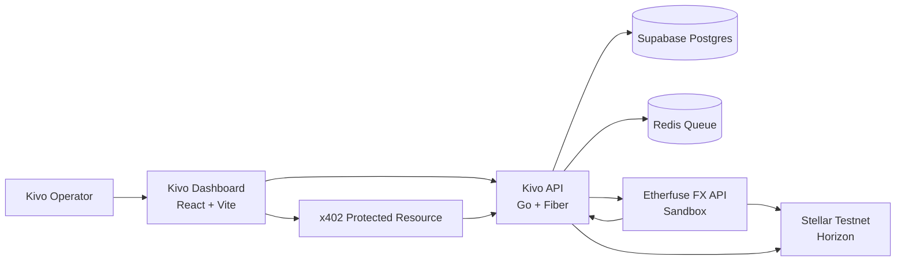
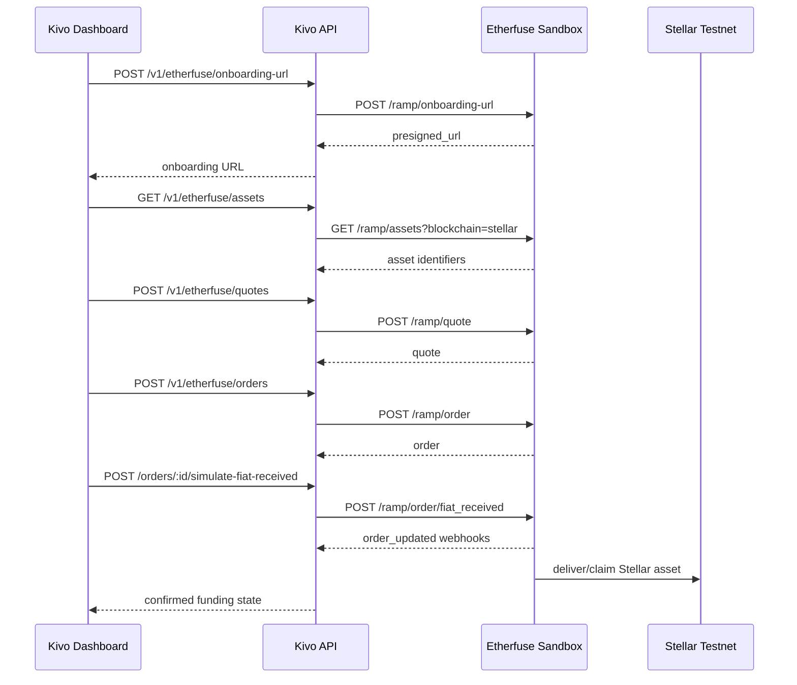
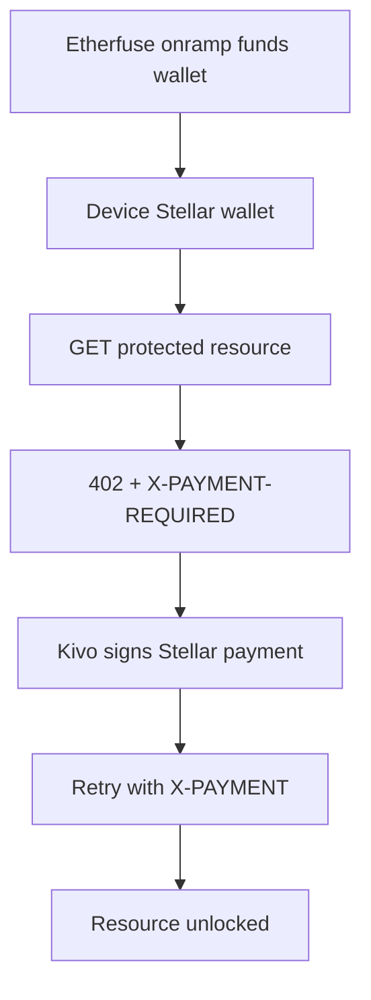

# Etherfuse Integration

This document specifies how Kivo Pay integrates with the Etherfuse FX API as the fiat/stablecoin anchor layer for Stellar testnet demos and future production ramps.

Kivo's core M2M flow still settles on Stellar. Etherfuse is not replacing x402, device wallets, conditional payments, or the Kivo payment worker. Etherfuse adds the missing bridge around those flows: customer onboarding, fiat funding, fiat payout, stablecoin/stablebond discovery, quotes, orders, and webhook-driven ramp status.

**Last verified:** 2026-05-16 against the public Etherfuse docs.

**Primary references:**
- [Etherfuse Initial Setup](https://docs.etherfuse.com/initial-setup)
- [Etherfuse Overview](https://docs.etherfuse.com/overview)
- [Etherfuse Sandbox Reference](https://docs.etherfuse.com/test-environment)
- [Get Rampable Assets](https://docs.etherfuse.com/api-reference/assets/get-rampable-assets)
- [Get Quote for Conversion](https://docs.etherfuse.com/api-reference/quotes/get-quote-for-conversion)
- [Create a New Order](https://docs.etherfuse.com/api-reference/orders/create-a-new-order)
- [Simulate Fiat Received](https://docs.etherfuse.com/sandbox-api/fiat-received)
- [Verifying Webhooks](https://docs.etherfuse.com/guides/verifying-webhooks)

---

## Why Etherfuse Exists In Kivo

Kivo has two payment surfaces:

| Surface | What it does | Rail |
|---|---|---|
| `M2M / x402` | Machines and agents pay for resources, energy, compute, APIs, or data | Stellar transaction encoded in HTTP headers |
| `Anchor / Ramp` | Humans or operators fund and exit the Stellar side of the system | Etherfuse FX API + Stellar testnet/mainnet |

For the hackathon/MVP, Etherfuse should prove that Kivo is not just a closed testnet toy. A device or operator can obtain testnet liquidity through a real anchor-style workflow, use that liquidity in Kivo, and trace the state through webhooks and Stellar transaction references.

The clean demo story is:

1. Operator opens Kivo dashboard.
2. Kivo creates or uses a device Stellar wallet.
3. Kivo checks Etherfuse rampable assets for that wallet.
4. Kivo creates an onramp quote and order in Etherfuse sandbox.
5. Sandbox simulates fiat received.
6. Etherfuse advances the order through webhooks.
7. Kivo records the order, resulting asset, Stellar transaction/signature/claim transaction, and wallet funding state.
8. The funded device uses x402 or a conditional M2M payment inside Kivo.

---

## Scope

### MVP Scope

The MVP integration must support:

- Etherfuse sandbox base URL: `https://api.sand.etherfuse.com`
- Auth with `Authorization: <api-key>` directly, with no `Bearer` prefix.
- Stellar testnet as the blockchain target.
- Hosted onboarding URL generation for a Kivo operator/customer.
- Rampable asset discovery for a Stellar wallet.
- Onramp quote creation.
- Onramp order creation.
- Sandbox fiat receipt simulation.
- Webhook registration and verification.
- Order polling fallback for dashboard refresh.
- x402 funding visibility in the Kivo dashboard.

### Production Scope Later

Production adds:

- Production base URL: `https://api.etherfuse.com`
- Real KYC and compliance review.
- Real fiat movement.
- Production webhook secret storage and rotation.
- Production-specific asset allowlist.
- Reconciliation reports.
- Operational alerting on failed or stuck orders.

---

## Architecture



Etherfuse is called only from the backend. The frontend never sees `ETHERFUSE_API_KEY`, `ETHERFUSE_WEBHOOK_SECRET`, or raw anchor credentials.

---

## Environments

| Environment | Etherfuse URL | Stellar Network | Purpose |
|---|---|---|---|
| Local mock | none | mocked/testnet-like | UI and contract development with no external credentials |
| Sandbox | `https://api.sand.etherfuse.com` | Stellar testnet | Hackathon demo and integration testing |
| Production | `https://api.etherfuse.com` | Stellar mainnet | Real customers and real funds |

Recommended environment variable:

```bash
ETHERFUSE_MODE=mock # mock | sandbox | production
```

The application should reject `ETHERFUSE_MODE=production` unless all production secrets and compliance flags are explicitly present.

---

## Required Environment Variables

```bash
# Etherfuse
ETHERFUSE_MODE=sandbox
ETHERFUSE_BASE_URL=https://api.sand.etherfuse.com
ETHERFUSE_API_KEY=your-sandbox-api-key
ETHERFUSE_WEBHOOK_SECRET=base64-secret-returned-on-webhook-create
ETHERFUSE_WEBHOOK_URL=https://your-public-api.example.com/v1/etherfuse/webhook

# Kivo public API
KIVO_API_BASE_URL=https://api.kivo.example
KIVO_DASHBOARD_URL=https://dashboard.kivo.example

# Stellar
STELLAR_NETWORK=testnet
STELLAR_HORIZON_URL=https://horizon-testnet.stellar.org
USDC_ISSUER=GBBD47IF6LWK7P7MDEVSCWR7DPUWV3NY3DTQEVFL4NAT4AQH3ZLLFLA5
USDC_ASSET=USDC:GBBD47IF6LWK7P7MDEVSCWR7DPUWV3NY3DTQEVFL4NAT4AQH3ZLLFLA5

# Optional product policy
ETHERFUSE_DEFAULT_FIAT=MXN
ETHERFUSE_DEFAULT_TARGET_ASSET=USDC:GBBD47IF6LWK7P7MDEVSCWR7DPUWV3NY3DTQEVFL4NAT4AQH3ZLLFLA5
ETHERFUSE_PARTNER_FEE_BPS=0
```

The public Etherfuse docs currently use `MXN` examples for the fiat side. Kivo can present BRL/Pix in product copy only when the connected Etherfuse sandbox account exposes the required fiat/country configuration. Do not hardcode BRL/Pix in backend logic unless the account's assets, onboarding, and bank account responses confirm it.

---

## Key Concepts

| Concept | Owner | Meaning In Kivo |
|---|---|---|
| `customerId` | Kivo generates | Stable UUID linking a Kivo operator/customer to Etherfuse onboarding |
| `bankAccountId` | Kivo generates | Stable UUID linking that customer to an Etherfuse fiat account |
| `publicKey` / `walletAddress` | Kivo device or operator wallet | Stellar public key used for onramp/offramp/swap |
| `identifier` | Etherfuse asset response | Asset string in `CODE:ISSUER` format, used in quotes |
| `quoteId` | Kivo generates | Short-lived quote identifier sent to Etherfuse |
| `orderId` | Kivo generates | Order identifier used for webhooks and reconciliation |
| `order_updated` | Etherfuse webhook | Canonical order status event |
| `stellarClaimTransaction` | Etherfuse onramp result | Unsigned Stellar XDR that may need signing to claim tokens |
| `confirmedTxSignature` | Etherfuse order result | Stellar transaction hash/signature for completed movement |

Important invariant: `customerId`, `bankAccountId`, and `publicKey` must remain bound to the same Kivo owner/device. Never mix these IDs across users, workspaces, or devices.

---

## Asset Strategy

For the Kivo MVP, use USDC on Stellar testnet as the stable settlement asset:

```txt
USDC:GBBD47IF6LWK7P7MDEVSCWR7DPUWV3NY3DTQEVFL4NAT4AQH3ZLLFLA5
```

This value appears in Etherfuse sandbox examples for Stellar USDC. Still, the backend should discover assets dynamically through `GET /ramp/assets` and treat the env var as a fallback/allowlist.

Kivo should store:

```sql
asset_code TEXT NOT NULL,          -- USDC
asset_issuer TEXT NOT NULL,        -- GBBD...
asset_identifier TEXT NOT NULL,    -- USDC:GBBD...
asset_source TEXT NOT NULL,        -- etherfuse | kivo | manual
network TEXT NOT NULL              -- testnet | mainnet
```

---

## Kivo Backend API Contract

Kivo exposes its own stable API to the dashboard. The backend translates those requests into Etherfuse calls.

### `GET /v1/etherfuse/status`

Checks local configuration and performs a lightweight authenticated call when credentials are present.

```json
{
  "mode": "sandbox",
  "configured": true,
  "base_url": "https://api.sand.etherfuse.com",
  "network": "testnet",
  "default_asset": "USDC:GBBD47IF6LWK7P7MDEVSCWR7DPUWV3NY3DTQEVFL4NAT4AQH3ZLLFLA5",
  "webhook_url": "https://api.kivo.example/v1/etherfuse/webhook",
  "last_checked_at": "2026-05-16T16:20:00Z"
}
```

### `POST /v1/etherfuse/onboarding-url`

Creates a hosted onboarding URL for an operator/customer.

```json
{
  "customer_id": "2a1d9134-e6d0-4b7e-bf88-00b79c25155b",
  "bank_account_id": "80dd9b70-581f-4b43-b634-b4cfdd481d6d",
  "public_key": "GDUKMGUGD3V6VXTU2RLAUM7A2FABLMHCPWTMDHKP7HHJ6FCZKEY4PVWL",
  "blockchain": "stellar",
  "user_info": {
    "email": "operator@kivo.example",
    "display_name": "Kivo Operator"
  }
}
```

Kivo forwards to Etherfuse as `POST /ramp/onboarding-url`.

### `GET /v1/etherfuse/assets?wallet=G...&currency=MXN`

Returns rampable assets for a Stellar wallet.

```json
{
  "assets": [
    {
      "symbol": "USDC",
      "identifier": "USDC:GBBD47IF6LWK7P7MDEVSCWR7DPUWV3NY3DTQEVFL4NAT4AQH3ZLLFLA5",
      "name": "USD Coin",
      "currency": "usd",
      "balance": "100.50"
    }
  ]
}
```

Kivo forwards to Etherfuse as `GET /ramp/assets?blockchain=stellar&currency=<currency>&wallet=<wallet>`.

### `POST /v1/etherfuse/quotes`

Creates an onramp, offramp, or swap quote.

```json
{
  "type": "onramp",
  "source_asset": "MXN",
  "target_asset": "USDC:GBBD47IF6LWK7P7MDEVSCWR7DPUWV3NY3DTQEVFL4NAT4AQH3ZLLFLA5",
  "source_amount": "100",
  "wallet_address": "GDUKMGUGD3V6VXTU2RLAUM7A2FABLMHCPWTMDHKP7HHJ6FCZKEY4PVWL",
  "customer_id": "2a1d9134-e6d0-4b7e-bf88-00b79c25155b"
}
```

Etherfuse request shape:

```json
{
  "quoteId": "6edc1703-e8f6-47b1-a33a-ac776d01332a",
  "customerId": "2a1d9134-e6d0-4b7e-bf88-00b79c25155b",
  "blockchain": "stellar",
  "quoteAssets": {
    "type": "onramp",
    "sourceAsset": "MXN",
    "targetAsset": "USDC:GBBD47IF6LWK7P7MDEVSCWR7DPUWV3NY3DTQEVFL4NAT4AQH3ZLLFLA5"
  },
  "sourceAmount": "100",
  "walletAddress": "GDUKMGUGD3V6VXTU2RLAUM7A2FABLMHCPWTMDHKP7HHJ6FCZKEY4PVWL",
  "partnerFeeBps": 0
}
```

### `POST /v1/etherfuse/orders`

Creates an order from a quote before the quote expires.

```json
{
  "quote_id": "6edc1703-e8f6-47b1-a33a-ac776d01332a",
  "bank_account_id": "80dd9b70-581f-4b43-b634-b4cfdd481d6d",
  "public_key": "GDUKMGUGD3V6VXTU2RLAUM7A2FABLMHCPWTMDHKP7HHJ6FCZKEY4PVWL",
  "memo": "kivo-demo-001"
}
```

Etherfuse request shape:

```json
{
  "orderId": "ed14a9d7-f9be-4584-8f11-527d32ddab31",
  "bankAccountId": "80dd9b70-581f-4b43-b634-b4cfdd481d6d",
  "publicKey": "GDUKMGUGD3V6VXTU2RLAUM7A2FABLMHCPWTMDHKP7HHJ6FCZKEY4PVWL",
  "quoteId": "6edc1703-e8f6-47b1-a33a-ac776d01332a",
  "memo": "kivo-demo-001"
}
```

### `GET /v1/etherfuse/orders/:id`

Fetches the latest order details and merges the result into Kivo's local record.

### `POST /v1/etherfuse/orders/:id/simulate-fiat-received`

Sandbox-only endpoint. Kivo forwards to Etherfuse `POST /ramp/order/fiat_received`.

```json
{
  "orderId": "ed14a9d7-f9be-4584-8f11-527d32ddab31"
}
```

The endpoint must return `403` unless `ETHERFUSE_MODE=sandbox`.

### `POST /v1/etherfuse/webhook`

Receives Etherfuse webhook events. This route must not require Supabase JWT or Kivo device API key. It authenticates using Etherfuse `X-Signature`.

---

## Etherfuse Service Interface

The Go backend should isolate Etherfuse behind an interface so the dashboard can run without credentials and tests can use deterministic mocks.

```go
package etherfuse

import "context"

type Client interface {
    Status(ctx context.Context) (Status, error)
    CreateOnboardingURL(ctx context.Context, req OnboardingURLRequest) (OnboardingURLResponse, error)
    ListAssets(ctx context.Context, req ListAssetsRequest) (ListAssetsResponse, error)
    CreateQuote(ctx context.Context, req CreateQuoteRequest) (Quote, error)
    CreateOrder(ctx context.Context, req CreateOrderRequest) (Order, error)
    GetOrder(ctx context.Context, orderID string) (Order, error)
    RegenerateOrderTransaction(ctx context.Context, orderID string) (RegeneratedTransaction, error)
    SimulateFiatReceived(ctx context.Context, orderID string) error
    RegisterWebhook(ctx context.Context, req RegisterWebhookRequest) (WebhookRegistration, error)
    VerifyWebhook(body any, signatureHeader string) bool
}
```

Implementation classes:

| Class | Use |
|---|---|
| `HTTPClient` | Real Etherfuse sandbox/production |
| `MockClient` | No credentials, local demos, UI tests |
| `RecordingClient` | Integration tests that replay saved sandbox payloads |

---

## Data Model Additions

Add these tables to Kivo's Postgres schema.

```sql
CREATE TABLE etherfuse_profiles (
    id UUID PRIMARY KEY DEFAULT gen_random_uuid(),
    owner_id UUID NOT NULL,
    customer_id UUID NOT NULL UNIQUE,
    bank_account_id UUID NOT NULL UNIQUE,
    public_key TEXT NOT NULL,
    blockchain TEXT NOT NULL DEFAULT 'stellar',
    status TEXT NOT NULL DEFAULT 'created',
    onboarding_url TEXT,
    onboarding_expires_at TIMESTAMPTZ,
    kyc_status TEXT,
    bank_account_status TEXT,
    created_at TIMESTAMPTZ NOT NULL DEFAULT now(),
    updated_at TIMESTAMPTZ NOT NULL DEFAULT now()
);

CREATE TABLE etherfuse_quotes (
    id UUID PRIMARY KEY DEFAULT gen_random_uuid(),
    owner_id UUID NOT NULL,
    etherfuse_quote_id UUID NOT NULL UNIQUE,
    customer_id UUID NOT NULL,
    quote_type TEXT NOT NULL CHECK (quote_type IN ('onramp', 'offramp', 'swap')),
    source_asset TEXT NOT NULL,
    target_asset TEXT NOT NULL,
    source_amount NUMERIC(18, 7) NOT NULL,
    destination_amount NUMERIC(18, 7),
    destination_amount_after_fee NUMERIC(18, 7),
    exchange_rate TEXT,
    fee_bps TEXT,
    fee_amount TEXT,
    partner_fee_bps INT,
    expires_at TIMESTAMPTZ NOT NULL,
    raw_response JSONB NOT NULL DEFAULT '{}'::jsonb,
    created_at TIMESTAMPTZ NOT NULL DEFAULT now()
);

CREATE TABLE etherfuse_orders (
    id UUID PRIMARY KEY DEFAULT gen_random_uuid(),
    owner_id UUID NOT NULL,
    etherfuse_order_id UUID NOT NULL UNIQUE,
    etherfuse_quote_id UUID NOT NULL,
    customer_id UUID NOT NULL,
    bank_account_id UUID NOT NULL,
    public_key TEXT NOT NULL,
    order_type TEXT NOT NULL,
    status TEXT NOT NULL DEFAULT 'created',
    deposit_clabe TEXT,
    deposit_amount TEXT,
    burn_transaction TEXT,
    stellar_claim_transaction TEXT,
    confirmed_tx_signature TEXT,
    memo TEXT,
    status_page TEXT,
    error_message TEXT,
    raw_response JSONB NOT NULL DEFAULT '{}'::jsonb,
    completed_at TIMESTAMPTZ,
    created_at TIMESTAMPTZ NOT NULL DEFAULT now(),
    updated_at TIMESTAMPTZ NOT NULL DEFAULT now()
);

CREATE TABLE etherfuse_webhook_events (
    id UUID PRIMARY KEY DEFAULT gen_random_uuid(),
    event_id TEXT,
    event_type TEXT NOT NULL,
    etherfuse_order_id UUID,
    signature TEXT,
    status TEXT,
    payload JSONB NOT NULL,
    received_at TIMESTAMPTZ NOT NULL DEFAULT now(),
    processed_at TIMESTAMPTZ
);

CREATE INDEX etherfuse_orders_owner_idx ON etherfuse_orders(owner_id);
CREATE INDEX etherfuse_orders_status_idx ON etherfuse_orders(status);
CREATE INDEX etherfuse_events_order_idx ON etherfuse_webhook_events(etherfuse_order_id);
```

Kivo may later merge some fields into `payments` if an Etherfuse order directly funds a Kivo payment. For the MVP, keep ramp records separate and link them with optional foreign keys once the payment model stabilizes.

---

## Webhook Verification

Etherfuse webhooks include an `X-Signature` header. The public docs describe HMAC-SHA256 over canonical JSON, using a base64-decoded secret returned when the webhook is created.

Kivo must:

1. Store the webhook secret encrypted.
2. Canonicalize JSON before verification.
3. Compare signatures using constant-time comparison.
4. Store the event before processing it.
5. Make processing idempotent by `event_id` when present, or by `(event_type, order_id, status, received_at bucket)` when no event id is provided.
6. Return a 2xx response only after the event is safely stored.

Go sketch:

```go
func VerifyEtherfuseWebhook(payload []byte, secretBase64 string, signatureHeader string) bool {
    key, err := base64.StdEncoding.DecodeString(secretBase64)
    if err != nil {
        return false
    }

    canonical, err := jcs.Transform(payload)
    if err != nil {
        return false
    }

    mac := hmac.New(sha256.New, key)
    mac.Write(canonical)
    expected := "sha256=" + hex.EncodeToString(mac.Sum(nil))

    return subtle.ConstantTimeCompare([]byte(expected), []byte(signatureHeader)) == 1
}
```

If the first demo uses a sandbox account before webhook secret wiring is complete, Kivo can run in `ETHERFUSE_WEBHOOK_VERIFY=false` only for local/sandbox. Production must refuse to boot with webhook verification disabled.

---

## Order Status Mapping

Kivo should keep the original Etherfuse status and map it to Kivo dashboard states.

| Etherfuse status | Kivo status | Meaning |
|---|---|---|
| `created` | `pending` | Order created, waiting for fiat deposit or transaction signature |
| `funded` | `processing` | Fiat or crypto leg received |
| `completed` | `confirmed` | Target asset delivered or fiat payout completed |
| `finalized` | `confirmed` | Offramp reversal window closed |
| `failed` | `failed` | Order failed |
| `refunded` | `refunded` | Funds returned |
| `canceled` | `expired` | Order canceled before funding |

For dashboard display, always show both:

```json
{
  "status": "confirmed",
  "provider": "etherfuse",
  "provider_status": "completed"
}
```

---

## Onramp Flow

Use this when a Kivo operator or device needs testnet liquidity.



### Onramp Demo Checklist

- [ ] `ETHERFUSE_API_KEY` exists.
- [ ] `GET /v1/etherfuse/status` returns `configured: true`.
- [ ] Device/operator wallet exists on Stellar testnet.
- [ ] Hosted onboarding URL can be generated.
- [ ] `GET /v1/etherfuse/assets` returns at least one Stellar asset.
- [ ] Quote uses a live `identifier`, not a hardcoded stale issuer.
- [ ] Order is created before quote expiry.
- [ ] Sandbox `fiat_received` advances order.
- [ ] `order_updated` webhook is stored.
- [ ] Dashboard displays `confirmedTxSignature` or `stellarClaimTransaction`.

---

## Offramp Flow

Use this when a Kivo operator wants to exit Stellar assets into fiat.

1. Verify the wallet has the required trustline and balance.
2. Create an offramp quote with `sourceAsset` as the Stellar asset identifier and `targetAsset` as the fiat currency.
3. Create an order from the quote.
4. Sign the Etherfuse-provided transaction (`burnTransaction` or regenerated transaction when needed).
5. Submit to Stellar testnet.
6. Wait for `order_updated` webhooks.
7. Mark the order `completed`/`finalized` in Kivo.

Production caution: Kivo should never silently submit an offramp transaction from a user's wallet unless the custody model explicitly allows it. For non-custodial wallets, the dashboard should show the XDR and ask the connected wallet to sign.

---

## Swap Flow

Use this only after the onramp path works.

Swap lets Kivo convert one crypto asset to another, for example Stellar sandbox USDC to a stablebond. The flow is asynchronous:

1. `POST /ramp/quote` with `quoteAssets.type = "swap"`.
2. `POST /ramp/swap` with `orderId`, `quoteId`, `publicKey`, and `blockchain: "stellar"`.
3. Wait for `swap_updated` webhook.
4. Sign the `sendTransaction` returned through the webhook.
5. Submit to Stellar.
6. Wait for `swap_completed`.

Kivo should expose swaps in the dashboard only as an advanced operation until the normal onramp path is stable.

---

## x402 + Etherfuse

Etherfuse does not implement Kivo's x402 header protocol. The integration point is liquidity and reconciliation.

Kivo uses Etherfuse to fund or unwind wallets, then x402 uses those wallets to pay for protected resources.



Dashboard copy should say:

> Etherfuse anchors liquidity into the Stellar wallet. Kivo x402 spends from that wallet to unlock machine resources.

Avoid saying:

> Etherfuse processes x402.

That would be inaccurate.

---

## Dashboard Requirements

Add a Kivo dashboard section called **Etherfuse Anchor** with these panels:

| Panel | Required fields |
|---|---|
| Status | mode, base URL, configured, webhook URL, network |
| Wallet | Stellar public key, XLM balance, USDC balance, trustline status |
| Assets | identifier, symbol, currency, balance |
| Quote | type, source asset, target asset, source amount, destination amount, fee, expiry |
| Order | order ID, provider status, Kivo status, status page, tx signature, claim transaction |
| Webhooks | latest event type, status, received time, signature verified |
| x402 bridge | funding source, available balance, protected route, last paid nonce |

For the hackathon demo, show a single happy path:

```txt
Etherfuse sandbox onramp -> Stellar testnet USDC -> Kivo x402 payment -> dashboard confirmation
```

---

## Frontend Mock Contract

The frontend should support the integration before real credentials exist.

```ts
export interface EtherfuseStatus {
  mode: 'mock' | 'sandbox' | 'production';
  configured: boolean;
  baseUrl: string;
  network: 'testnet' | 'mainnet';
  defaultAsset: string;
  webhookUrl?: string;
  lastCheckedAt: string;
}

export interface EtherfuseAsset {
  symbol: string;
  identifier: string;
  name?: string;
  currency: string;
  balance?: string | null;
  image?: string;
}

export interface EtherfuseQuote {
  quoteId: string;
  blockchain: 'stellar';
  type: 'onramp' | 'offramp' | 'swap';
  sourceAsset: string;
  targetAsset: string;
  sourceAmount: string;
  destinationAmount: string;
  destinationAmountAfterFee?: string;
  exchangeRate?: string;
  feeBps?: string;
  feeAmount?: string;
  expiresAt: string;
}

export interface EtherfuseOrder {
  orderId: string;
  quoteId: string;
  type: 'onramp' | 'offramp' | 'swap';
  status: string;
  kivoStatus: 'pending' | 'processing' | 'confirmed' | 'failed' | 'expired' | 'refunded';
  depositClabe?: string;
  depositAmount?: string;
  burnTransaction?: string;
  stellarClaimTransaction?: string;
  confirmedTxSignature?: string;
  statusPage?: string;
  createdAt: string;
  updatedAt: string;
}
```

Mock data must clearly display `sandbox-ready` when no API key is present, not pretend real Etherfuse calls were made.

---

## Security Rules

1. Never expose `ETHERFUSE_API_KEY` to the browser.
2. Never log `ETHERFUSE_API_KEY` or webhook secret.
3. Encrypt webhook secrets at rest.
4. Store raw webhook payloads for audit but redact personal data in application logs.
5. Verify `X-Signature` for all non-local webhook events.
6. Reject stale or duplicate webhook events.
7. Validate every `publicKey` as a Stellar public key before sending to Etherfuse.
8. Validate `quoteId`, `orderId`, `customerId`, and `bankAccountId` as UUIDs.
9. Enforce ownership before showing order details in dashboard.
10. For offramps, require explicit operator approval before signing/submitting a transaction.

---

## Error Handling

| Error | Likely cause | Kivo action |
|---|---|---|
| `401 Unauthorized` | Invalid API key or wrong auth header format | Show configuration error, do not retry blindly |
| `Quote expired` | Order was created after quote expiry | Create a fresh quote |
| `Proxy account not found` | `customerId` or `publicKey` does not match onboarding | Lock the profile and ask operator to re-onboard |
| `Bank account not found` | `bankAccountId` mismatch | Re-fetch onboarding status |
| `order not in created status` | Sandbox fiat simulation called at wrong stage | Refresh order and show actual status |
| Missing trustline | Wallet not ready for offramp/swap | Ask wallet to add trustline or use onramp setup flow |
| Webhook signature mismatch | Wrong secret or tampered payload | Store rejected event with `signature_valid=false` and return `401` |

---

## Local Demo Runbook

Use this when the team needs a demo today.

### 1. Configure sandbox

```bash
cd apps/kivo
cp .env.example .env

ETHERFUSE_MODE=sandbox
ETHERFUSE_BASE_URL=https://api.sand.etherfuse.com
ETHERFUSE_API_KEY=<sandbox-key>
ETHERFUSE_WEBHOOK_URL=https://<ngrok-or-public-api>/v1/etherfuse/webhook
STELLAR_NETWORK=testnet
USDC_ASSET=USDC:GBBD47IF6LWK7P7MDEVSCWR7DPUWV3NY3DTQEVFL4NAT4AQH3ZLLFLA5
```

### 2. Expose local API

```bash
ngrok http 8080
```

Set `ETHERFUSE_WEBHOOK_URL` to the ngrok HTTPS URL plus `/v1/etherfuse/webhook`.

### 3. Register webhook

```bash
curl -X POST https://api.sand.etherfuse.com/ramp/webhook \
  -H "Authorization: $ETHERFUSE_API_KEY" \
  -H "Content-Type: application/json" \
  -d '{
    "id": "2fd4db1f-9642-4c78-b43a-08227806ea91",
    "eventType": "order_updated",
    "url": "https://<ngrok-host>/v1/etherfuse/webhook"
  }'
```

Etherfuse expects `eventType` in camelCase for webhook registration. Store the returned `secret` as `ETHERFUSE_WEBHOOK_SECRET`.

### 4. Create or select wallet

Use a Kivo device wallet. The dashboard should display its Stellar public key.

### 5. Discover assets

```bash
curl "https://api.sand.etherfuse.com/ramp/assets?blockchain=stellar&currency=MXN&wallet=$STELLAR_PUBLIC_KEY" \
  -H "Authorization: $ETHERFUSE_API_KEY"
```

### 6. Create quote

```bash
curl -X POST https://api.sand.etherfuse.com/ramp/quote \
  -H "Authorization: $ETHERFUSE_API_KEY" \
  -H "Content-Type: application/json" \
  -d '{
    "quoteId": "6edc1703-e8f6-47b1-a33a-ac776d01332a",
    "customerId": "2a1d9134-e6d0-4b7e-bf88-00b79c25155b",
    "blockchain": "stellar",
    "quoteAssets": {
      "type": "onramp",
      "sourceAsset": "MXN",
      "targetAsset": "USDC:GBBD47IF6LWK7P7MDEVSCWR7DPUWV3NY3DTQEVFL4NAT4AQH3ZLLFLA5"
    },
    "sourceAmount": "100",
    "walletAddress": "'"$STELLAR_PUBLIC_KEY"'"
  }'
```

### 7. Create order

```bash
curl -X POST https://api.sand.etherfuse.com/ramp/order \
  -H "Authorization: $ETHERFUSE_API_KEY" \
  -H "Content-Type: application/json" \
  -d '{
    "orderId": "ed14a9d7-f9be-4584-8f11-527d32ddab31",
    "bankAccountId": "80dd9b70-581f-4b43-b634-b4cfdd481d6d",
    "publicKey": "'"$STELLAR_PUBLIC_KEY"'",
    "quoteId": "6edc1703-e8f6-47b1-a33a-ac776d01332a"
  }'
```

### 8. Simulate fiat received

```bash
curl -X POST https://api.sand.etherfuse.com/ramp/order/fiat_received \
  -H "Authorization: $ETHERFUSE_API_KEY" \
  -H "Content-Type: application/json" \
  -d '{
    "orderId": "ed14a9d7-f9be-4584-8f11-527d32ddab31"
  }'
```

### 9. Confirm in Kivo

The dashboard should show:

- Etherfuse provider status: `funded` then `completed`
- Kivo status: `processing` then `confirmed`
- Stellar tx/signature or claim transaction when present
- Latest verified webhook event
- Wallet balance updated or claim action available

### 10. Spend through x402

Call the x402 playground after funding:

```bash
curl -i https://api.kivo.example/api/x402/data
```

Expected first response: `402 Payment Required`.

Then retry with `X-PAYMENT` generated by Kivo from the funded wallet.

---

## Production Readiness Checklist

- [ ] Sandbox integration runs with real Etherfuse API key.
- [ ] Webhook endpoint is publicly reachable.
- [ ] Webhook secret is stored encrypted.
- [ ] HMAC verification is enforced outside local mock mode.
- [ ] Orders are idempotent by `orderId`.
- [ ] Quotes cannot be used after `expiresAt`.
- [ ] Kivo profile locks `customerId`, `bankAccountId`, and `publicKey` together.
- [ ] Dashboard distinguishes mock, sandbox, and production.
- [ ] Offramp signing requires explicit approval.
- [ ] Production mode cannot boot with sandbox URL.
- [ ] All provider errors are visible in `/deploy` and Etherfuse dashboard panel.
- [ ] Runbook includes ngrok/public webhook setup.
- [ ] Reconciliation export includes Kivo payment ID, Etherfuse order ID, Stellar hash, amount, asset, and status.

---

## Implementation Order

1. Add TypeScript frontend mock types and Kivo API client methods.
2. Add dashboard route `/etherfuse` or an Etherfuse panel inside `/deploy`.
3. Add Go `internal/etherfuse` package with mock and HTTP clients.
4. Add env loading and `/v1/etherfuse/status`.
5. Add asset discovery.
6. Add quote creation.
7. Add order creation.
8. Add sandbox fiat simulation.
9. Add webhook registration + `POST /v1/etherfuse/webhook`.
10. Add DB migrations.
11. Add dashboard smoke flow: status -> assets -> quote -> order -> simulate -> webhook -> x402.

---

## Notes From Existing Repo

The SocialPay app already contains useful Etherfuse integration references:

- `apps/socialpay/lib/etherfuse.service.ts`
- `apps/socialpay/app/api/ramp/quote/route.ts`
- `apps/socialpay/app/api/ramp/order/route.ts`
- `apps/socialpay/app/api/webhooks/etherfuse/route.ts`

Reuse the operational lessons from those files, especially:

- API key is passed directly in `Authorization`.
- Sandbox base URL defaults to `https://api.sand.etherfuse.com`.
- Customer identifiers must be stable per user/wallet.
- Order polling immediately after creation may lag; webhooks are the canonical update path.
- Sandbox fiat simulation is a test helper, not a production endpoint.

Do not copy Next.js route code into Kivo. Port the behavior into Go/Fiber and keep the Kivo dashboard talking only to Kivo's own API.
