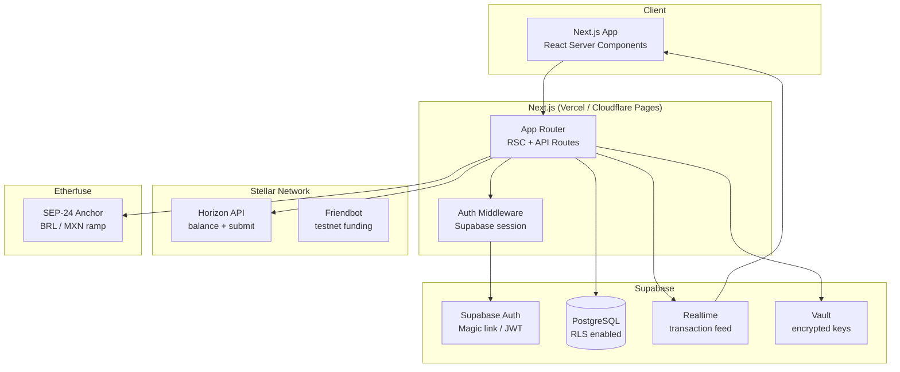

# Architecture & ADRs

This document covers the system architecture of SocialPay and the five key architectural decisions that shaped it. ADR-002 and ADR-005 document the ongoing refactor from Prisma+LibSQL+custom auth to Supabase.

---

## System Architecture



---

## App Router Directory Structure

```
app/
├── (auth)/
│   ├── login/page.tsx          # Magic link request form
│   └── callback/page.tsx       # Supabase auth callback
├── (app)/
│   ├── layout.tsx              # Authenticated shell
│   ├── dashboard/page.tsx      # Wallet overview + quick send
│   ├── feed/page.tsx           # Public + org transaction feed
│   ├── send/page.tsx           # Send payment form
│   └── profile/[handle]/page.tsx
├── api/
│   ├── auth/
│   │   ├── magic-link/route.ts
│   │   └── me/route.ts
│   ├── users/[handle]/route.ts
│   ├── transactions/
│   │   ├── send/route.ts
│   │   └── feed/route.ts
│   ├── wallet/
│   │   ├── balance/route.ts
│   │   ├── fund/route.ts
│   │   └── trustline/route.ts
│   ├── ramp/
│   │   ├── quote/route.ts
│   │   └── order/route.ts
│   ├── webhooks/
│   │   └── etherfuse/route.ts
│   └── x402/
│       └── analytics/route.ts
└── layout.tsx
```

---

## ADR-001: Next.js App Router

| Field | Value |
|---|---|
| **Status** | Accepted |
| **Date** | 2024-01 |

### Context

SocialPay needs a public-facing transaction feed (SEO-indexable), authenticated dashboard pages, and REST API endpoints — all in a single deployable unit.

### Decision

Use Next.js App Router with React Server Components and co-located API Route Handlers.

### Rationale

- **Co-location**: API routes and page components live in the same `app/` tree, simplifying data flow and reducing context switching
- **SSR for feed**: The public transaction feed is rendered server-side for SEO and initial load performance without a separate backend service
- **RSC**: Dashboard pages can fetch Supabase data directly in server components without client-side waterfalls
- **Single deploy**: One Vercel or Cloudflare Pages deployment serves both the frontend and the API — no separate Express/Fastify server to maintain

### Alternatives Rejected

- **Separate Next.js + Express API**: Additional operational complexity; API and frontend versions must be kept in sync
- **Remix**: Smaller ecosystem, less Supabase documentation, team unfamiliar
- **SvelteKit**: Would require rewriting all existing React components

### Consequences

- API routes share the same runtime as page rendering (Node.js edge or serverless)
- Middleware runs on every request and must be kept lightweight
- Cold start latency on serverless functions affects payment submission UX

---

## ADR-002: Supabase over Prisma + LibSQL

| Field | Value |
|---|---|
| **Status** | Accepted (refactor in progress) |
| **Date** | 2024-11 |

### Context

SocialPay was originally built with **Prisma ORM + LibSQL (SQLite-compatible)** as a lightweight local database. As the product grows, three problems emerged:

1. **SQLite under concurrent writes**: LibSQL handles concurrent reads well but degrades under concurrent write workloads (multiple simultaneous payments in the same organization)
2. **Custom session auth**: Custom bcrypt-based session management requires ongoing security maintenance, lacks magic link support, and does not interop with ContractEase's auth layer
3. **No realtime**: The transaction feed uses polling, which is inefficient and introduces UI lag

ContractEase (another SGR product) already uses Supabase. Consolidating the stack reduces operational surface area.

### Decision

Replace Prisma + LibSQL with **Supabase** across all three layers:

- **Database**: Supabase PostgreSQL replaces LibSQL
- **Auth**: Supabase Auth replaces custom bcrypt session
- **Realtime**: Supabase Realtime replaces polling for the transaction feed

### Rationale

- **Multi-tenancy via RLS**: PostgreSQL Row Level Security enforces org-level data isolation at the database layer, removing the need for application-level tenant filtering in every query
- **PostgreSQL concurrency**: Handles concurrent payment writes without write serialization issues
- **Unified auth**: One Supabase Auth project serves both SocialPay and ContractEase; users log in once and can access both products
- **Realtime native**: Supabase Realtime pushes transaction feed updates via WebSocket with zero polling overhead
- **Free tier scales**: Supabase's free tier includes 500MB PostgreSQL, 1M realtime messages/month, and 50k auth users — more than adequate for early organizations

### Alternatives Rejected

- **PlanetScale (MySQL)**: No RLS, no realtime, incompatible with Prisma's existing schema in non-trivial ways
- **Neon (PostgreSQL)**: No built-in auth or realtime; would require separate auth service
- **Keep LibSQL + add Turso**: Turso adds distributed SQLite but still lacks native auth and realtime

### Consequences

- Prisma schema must be rewritten as raw SQL migrations for Supabase
- Client code replaces `prisma.user.findUnique()` with `supabase.from('profiles').select().eq('handle', handle)`
- RLS policies must be authored and tested carefully — a misconfigured policy is a data leak
- Supabase free tier limits (2 paused projects after 1 week inactive) require upgrading to Pro for production

---

## ADR-003: Custodial Wallets

| Field | Value |
|---|---|
| **Status** | Accepted |
| **Date** | 2024-01 |

### Context

Stellar payments require signing transactions with a secret key. There are two models: self-custodial (user holds keys) and custodial (platform holds keys on behalf of user).

### Decision

SocialPay uses **custodial wallets**: one Stellar keypair is generated per user at account creation, and the secret key is stored encrypted server-side (Supabase Vault or Edge Function environment).

### Rationale

- **UX**: Employees do not need to install Freighter, manage seed phrases, or understand key custody. The payment experience feels like a corporate banking app
- **Onboarding**: Zero friction — create account, receive magic link, you have a wallet
- **Security boundary**: The secret key never reaches the client browser; all signing happens in Next.js API routes or Supabase Edge Functions
- **Organization control**: Admins can freeze or revoke wallets for departed employees without user cooperation

### Alternatives Rejected

- **Self-custodial (Freighter wallet)**: High friction for non-crypto employees; requires browser extension; user loses access if seed phrase lost
- **Multi-sig**: Adds complexity; still requires each user to hold a key
- **Shared org wallet**: Cannot attribute transactions to individuals; no per-person limits

### Consequences

- Platform is responsible for key security — a compromise of the Supabase Vault would expose all user funds
- Key rotation strategy must be documented and practiced
- Users trust SocialPay as a custodian; terms of service must reflect this
- Future path: expose Freighter integration as a "power user" option for users who want self-custody

---

## ADR-004: @Handle System over Wallet Addresses

| Field | Value |
|---|---|
| **Status** | Accepted |
| **Date** | 2024-01 |

### Context

Stellar wallet addresses are 56-character Base32 strings (`GBKXYZ...ABCDEFG`). Requiring employees to exchange these for payments is error-prone and unintuitive.

### Decision

Implement a **@handle system** where each user and department has a short, human-readable identifier scoped to their organization. Handles resolve to Stellar public keys at transaction time.

### Rationale

- **Familiarity**: `@joao`, `@marketing` follow conventions from Slack, Twitter, and GitHub — immediately intuitive to non-crypto users
- **Error reduction**: Typos in a 5-character handle are more obvious and less likely than typos in a 56-character address
- **Org-scoping**: Handles are unique within an organization, not globally — `@joao` at Acme is different from `@joao` at Beta Corp. This allows natural naming without global namespace collisions
- **Indirection**: Handles can be reassigned (e.g., when a department wallet is handed off) without changing the payment syntax

### Alternatives Rejected

- **Email-based resolution**: Email is already a handle in most systems but requires exposing emails in the UI; handles are a separate identity layer
- **Stellar Federation** (`joao*socialpay.io`): Standard but complex to implement and requires a federation server; not org-scoped natively
- **ENS names**: Ethereum-specific, adds another dependency, not Stellar-native

### Consequences

- Handle uniqueness constraint is per-org, not global — queries must always include `organization_id`
- Handle changes (renames) must update all UI references but do not affect on-chain history
- Handle conflicts when two orgs merge must be handled during org merge workflows

---

## ADR-005: Supabase Auth over Custom Session

| Field | Value |
|---|---|
| **Status** | Accepted (refactor in progress) |
| **Date** | 2024-11 |

### Context

SocialPay originally implemented authentication using bcrypt password hashing, custom session tokens stored in a `sessions` table, and manual cookie management. This required ongoing security audits, did not support magic links, and was completely separate from ContractEase's auth system.

### Decision

Replace custom auth with **Supabase Auth**, using magic link (passwordless) as the primary login method.

### Rationale

- **Security**: Supabase Auth is maintained by a dedicated team, uses industry-standard JWT, handles token refresh, and receives security patches automatically
- **Magic link UX**: Passwordless login is more appropriate for a corporate tool than passwords — employees don't need to remember another password
- **JWT interop**: Supabase JWTs include the user's `sub` (UUID) and can be verified in Next.js middleware, Edge Functions, and Stellar transaction memos
- **Unified login**: With the same Supabase project serving SocialPay and ContractEase, a user can switch between products without re-authenticating
- **Organization invites**: Supabase's invite flow (send magic link to a specific email) maps cleanly to the "invite team member" feature

### Alternatives Rejected

- **Clerk**: Excellent DX but adds a third-party auth dependency; cost scales with users; not open source
- **Auth.js (NextAuth)**: Requires database adapter; less native integration with Supabase's RLS
- **Keep custom auth**: Technical debt; no magic link without significant additional work; security maintenance burden

### Consequences

- Custom `sessions` table and bcrypt logic are removed entirely
- Middleware must validate Supabase JWT on every authenticated request
- Password reset flows are replaced by magic link resend
- Existing users must be migrated: their email is imported into Supabase Auth, and they log in via magic link on next visit
