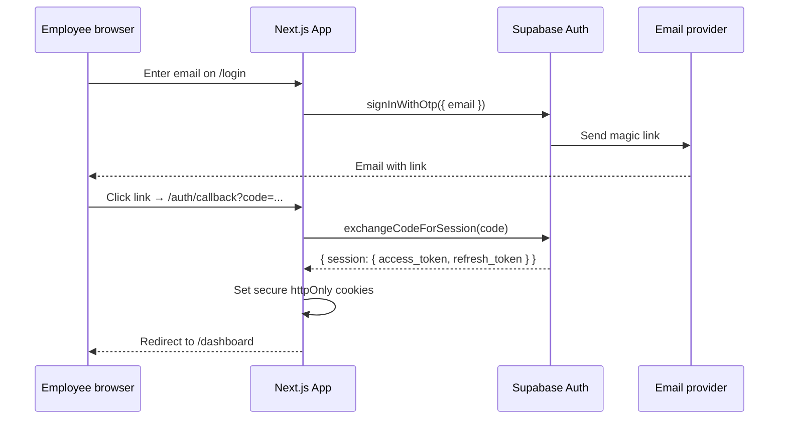
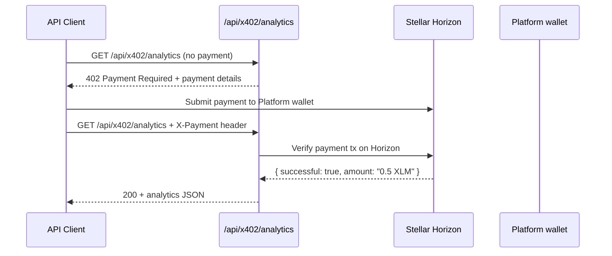

# Auth & Security

SocialPay handles real money and encrypted private keys. This document covers every security boundary: authentication, session management, wallet key storage, Row Level Security, rate limiting, and webhook verification.

---

## Supabase Auth: Magic Link Flow

SocialPay uses passwordless authentication via Supabase Auth. Employees receive a one-time login link by email — no passwords to remember, no password reset flows to maintain.



The auth callback route:

```typescript
// app/(auth)/callback/route.ts
import { createClient } from '@/lib/supabase-server';
import { NextResponse } from 'next/server';

export async function GET(request: Request) {
  const { searchParams } = new URL(request.url);
  const code = searchParams.get('code');

  if (code) {
    const supabase = createClient();
    await supabase.auth.exchangeCodeForSession(code);
  }

  return NextResponse.redirect(new URL('/dashboard', request.url));
}
```

---

## Session Management in App Router

### Middleware

Every authenticated request passes through Next.js middleware, which refreshes the Supabase session and blocks unauthenticated access to protected routes.

```typescript
// middleware.ts
import { createServerClient } from '@supabase/ssr';
import { NextResponse, type NextRequest } from 'next/server';

export async function middleware(request: NextRequest) {
  let response = NextResponse.next({ request });

  const supabase = createServerClient(
    process.env.NEXT_PUBLIC_SUPABASE_URL!,
    process.env.NEXT_PUBLIC_SUPABASE_ANON_KEY!,
    {
      cookies: {
        getAll: () => request.cookies.getAll(),
        setAll: (cs) => cs.forEach(c => response.cookies.set(c)),
      },
    }
  );

  const { data: { user } } = await supabase.auth.getUser();

  // Redirect unauthenticated users away from protected routes
  if (!user && request.nextUrl.pathname.startsWith('/dashboard')) {
    return NextResponse.redirect(new URL('/login', request.url));
  }

  return response;
}

export const config = {
  matcher: ['/dashboard/:path*', '/send/:path*', '/api/((?!auth|x402).*)'],
};
```

### Session Cookies

Supabase Auth sets `sb-access-token` and `sb-refresh-token` as `httpOnly`, `SameSite=Lax`, `Secure` cookies. The middleware automatically refreshes expired access tokens using the refresh token — users stay logged in without re-entering their email.

---

## Custodial Wallet Key Security

This is the highest-risk security boundary in SocialPay. The Stellar secret key grants full control over a user's funds. The key must be:

1. Generated server-side only — never in the browser
2. Stored encrypted — never as plaintext in any database column
3. Decrypted only in server-side code — never returned to the client
4. Auditable — all decryption events must be logged

### Key Generation

```typescript
// lib/wallet.ts
import { Keypair } from '@stellar/stellar-sdk';
import { createClient } from '@supabase/supabase-js';

const supabaseAdmin = createClient(
  process.env.NEXT_PUBLIC_SUPABASE_URL!,
  process.env.SUPABASE_SERVICE_ROLE_KEY!  // service role bypasses RLS
);

export async function generateWallet(userId: string): Promise<{ publicKey: string }> {
  const keypair = Keypair.random();

  // Store secret in Supabase Vault (AES-256 encrypted at rest)
  const { data: secret } = await supabaseAdmin.rpc('vault.create_secret', {
    secret: keypair.secret(),
    name: `wallet_${userId}`,
    description: `Stellar secret key for user ${userId}`
  });

  // Store vault reference + public key in wallets table
  await supabaseAdmin.from('wallets').insert({
    user_id: userId,
    stellar_public_key: keypair.publicKey(),
    vault_secret_id: secret.id,  // only the vault ID stored in the table
  });

  return { publicKey: keypair.publicKey() };
}

export async function loadWalletSecret(userId: string): Promise<string> {
  const { data: wallet } = await supabaseAdmin
    .from('wallets')
    .select('vault_secret_id')
    .eq('user_id', userId)
    .single();

  const { data } = await supabaseAdmin.rpc('vault.decrypted_secrets', {
    filter: { id: wallet.vault_secret_id }
  });

  return data[0].decrypted_secret;
}
```

### Security Properties

| Property | Implementation |
|---|---|
| Keys never in browser | Generated only in API routes / Edge Functions |
| Keys never in DB plaintext | Supabase Vault uses AES-256 encryption |
| Keys never in logs | `decrypted_secret` is never logged; only vault ID |
| Key access scoped | Only service role key can decrypt; anon key cannot |
| Audit trail | Vault access is logged by Supabase |

---

## Row Level Security: Transaction Visibility

Transaction visibility is enforced at the database layer via RLS. Even if application-level filtering fails, the database prevents data leaks.

```sql
-- Public: anyone (authenticated) can read
CREATE POLICY "tx_public_read" ON transactions
  FOR SELECT USING (visibility = 'public');

-- Org: only org members can read
CREATE POLICY "tx_org_read" ON transactions
  FOR SELECT USING (
    visibility = 'org'
    AND organization_id IN (
      SELECT org_id FROM organization_members WHERE user_id = auth.uid()
    )
  );

-- Private: only sender or receiver can read
CREATE POLICY "tx_private_read" ON transactions
  FOR SELECT USING (
    visibility = 'private'
    AND (sender_id = auth.uid() OR receiver_id = auth.uid())
  );
```

This means a Supabase query for the feed with `.select('*').from('transactions')` automatically returns only the rows the current user is authorized to see — no `WHERE` clause needed in application code.

---

## @Handle Uniqueness

Handles are unique **per organization**, not globally. The constraint is enforced at the database level:

```sql
UNIQUE (handle, organization_id)
```

This prevents application-level bugs from allowing duplicate handles. The `organization_id` is always required for handle resolution — a query like `WHERE handle = 'joao'` without an `organization_id` filter would return at most one row per handle per org, but cross-org collisions are permitted by design.

---

## x402 Analytics Endpoint

The `GET /api/x402/analytics` endpoint requires a micropayment to access. This prevents abuse and creates a revenue model for premium analytics consumers.



```typescript
// app/api/x402/analytics/route.ts
import { loadAccount } from '@stellar/stellar-sdk/minimal';

const PAYMENT_AMOUNT_XLM = '0.5';
const PLATFORM_PUBLIC_KEY = process.env.PLATFORM_PUBLIC_KEY!;

export async function GET(request: Request) {
  const paymentHeader = request.headers.get('X-Payment');

  if (!paymentHeader) {
    return Response.json({
      x402Version: 1,
      error: 'Payment required',
      accepts: [{
        scheme: 'exact',
        network: process.env.STELLAR_NETWORK === 'mainnet' ? 'stellar' : 'stellar-testnet',
        maxAmountRequired: String(parseFloat(PAYMENT_AMOUNT_XLM) * 10_000_000),
        asset: 'XLM',
        payTo: PLATFORM_PUBLIC_KEY,
      }]
    }, { status: 402 });
  }

  // Verify payment on Horizon
  const txHash = paymentHeader;
  const valid = await verifyPayment(txHash, PLATFORM_PUBLIC_KEY, PAYMENT_AMOUNT_XLM);
  if (!valid) return Response.json({ error: 'Invalid payment' }, { status: 402 });

  // Return analytics
  const analytics = await buildAnalytics();
  return Response.json(analytics);
}
```

---

## Rate Limiting

Rate limiting is applied at two levels:

### 1. Supabase Auth (built-in)

Supabase Auth automatically rate-limits magic link requests per email (default: 1 per 60 seconds). This prevents email flooding attacks.

### 2. API Route Rate Limiting (Upstash Redis)

Payment submission and ramp order creation are rate-limited using Upstash Redis:

```typescript
// lib/rate-limit.ts
import { Ratelimit } from '@upstash/ratelimit';
import { Redis } from '@upstash/redis';

const ratelimit = new Ratelimit({
  redis: Redis.fromEnv(),
  limiter: Ratelimit.slidingWindow(10, '1m'), // 10 requests per minute
});

export async function checkRateLimit(identifier: string) {
  const { success, reset, remaining } = await ratelimit.limit(identifier);
  return { success, reset, remaining };
}

// In a payment route:
const { success, reset } = await checkRateLimit(`send:${user.id}`);
if (!success) {
  return Response.json(
    { error: 'Rate limited' },
    { status: 429, headers: { 'Retry-After': String(Math.ceil((reset - Date.now()) / 1000)) } }
  );
}
```

Rate limits per endpoint:

| Endpoint | Limit | Window |
|---|---|---|
| `POST /api/transactions/send` | 10 | 1 minute |
| `POST /api/ramp/order` | 5 | 5 minutes |
| `POST /api/auth/magic-link` | 3 | 5 minutes |
| `GET /api/wallet/balance` | 60 | 1 minute |
| `GET /api/transactions/feed` | 120 | 1 minute |

---

## Etherfuse Webhook Verification

Etherfuse sends webhook events when ramp orders change status. These must be verified to prevent spoofed status updates that could credit USDC to wallets without actual payment.

```typescript
// app/api/webhooks/etherfuse/route.ts
import { createHmac } from 'crypto';

const ETHERFUSE_WEBHOOK_SECRET = process.env.ETHERFUSE_WEBHOOK_SECRET!;

function verifyEtherfuseSignature(payload: string, signature: string): boolean {
  const expected = createHmac('sha256', ETHERFUSE_WEBHOOK_SECRET)
    .update(payload)
    .digest('hex');
  // Use timing-safe comparison to prevent timing attacks
  return timingSafeEqual(Buffer.from(expected), Buffer.from(signature));
}

export async function POST(request: Request) {
  const rawBody = await request.text();
  const signature = request.headers.get('X-Etherfuse-Signature');

  if (!signature || !verifyEtherfuseSignature(rawBody, signature)) {
    return Response.json({ error: 'Invalid signature' }, { status: 401 });
  }

  const event = JSON.parse(rawBody);
  // Process confirmed order, update DB, credit USDC
  await handleEtherfuseEvent(event);

  return Response.json({ received: true });
}
```

All webhook events are idempotent — processing the same event twice must not double-credit any wallet. Use `ON CONFLICT (etherfuse_ref) DO NOTHING` or check current status before updating.
