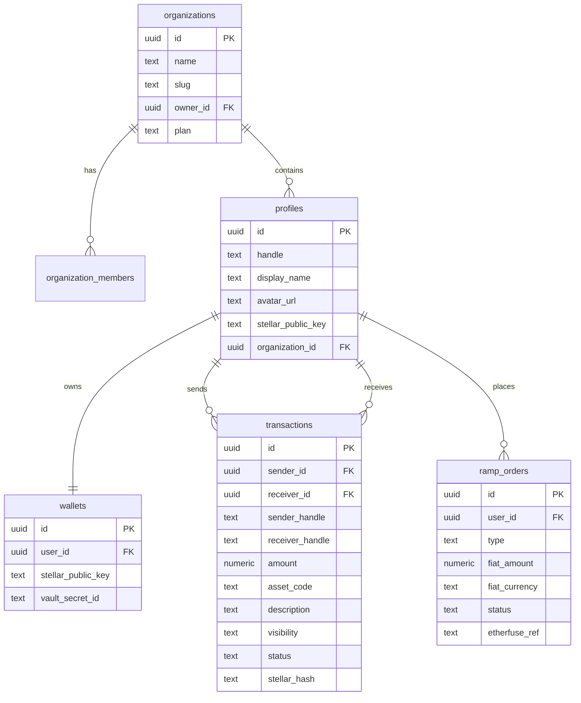

# Database Schema

SocialPay uses **Supabase PostgreSQL** as its primary data store after migrating from Prisma + LibSQL. All tables have Row Level Security (RLS) enabled. Wallet secrets are stored in Supabase Vault, not in plain table columns.

---

## Schema Overview



---

## Table Definitions

### `organizations`

Represents a company, DAO, or team that uses SocialPay as a group.

```sql
CREATE TABLE organizations (
  id          uuid PRIMARY KEY DEFAULT gen_random_uuid(),
  name        text NOT NULL,
  slug        text NOT NULL UNIQUE,           -- URL-safe identifier, e.g. "acme-corp"
  owner_id    uuid REFERENCES auth.users(id),
  plan        text NOT NULL DEFAULT 'free',  -- 'free' | 'pro' | 'enterprise'
  created_at  timestamptz NOT NULL DEFAULT now(),
  updated_at  timestamptz NOT NULL DEFAULT now()
);

ALTER TABLE organizations ENABLE ROW LEVEL SECURITY;
```

### `organization_members`

Junction table tracking which users belong to which organization and their role.

```sql
CREATE TABLE organization_members (
  id          uuid PRIMARY KEY DEFAULT gen_random_uuid(),
  org_id      uuid NOT NULL REFERENCES organizations(id) ON DELETE CASCADE,
  user_id     uuid NOT NULL REFERENCES auth.users(id) ON DELETE CASCADE,
  role        text NOT NULL DEFAULT 'member', -- 'owner' | 'admin' | 'member'
  joined_at   timestamptz NOT NULL DEFAULT now(),
  UNIQUE (org_id, user_id)
);

ALTER TABLE organization_members ENABLE ROW LEVEL SECURITY;
```

### `profiles`

Extends `auth.users` with SocialPay-specific fields. Created automatically on user signup via a Supabase database trigger.

```sql
CREATE TABLE profiles (
  id                    uuid PRIMARY KEY REFERENCES auth.users(id) ON DELETE CASCADE,
  handle                text NOT NULL,
  display_name          text,
  avatar_url            text,
  stellar_public_key    text UNIQUE,           -- G... public key
  organization_id       uuid REFERENCES organizations(id),
  created_at            timestamptz NOT NULL DEFAULT now(),
  updated_at            timestamptz NOT NULL DEFAULT now(),
  UNIQUE (handle, organization_id)             -- handles are unique per org, not globally
);

ALTER TABLE profiles ENABLE ROW LEVEL SECURITY;

-- Auto-create profile on signup
CREATE OR REPLACE FUNCTION handle_new_user()
RETURNS trigger AS $$
BEGIN
  INSERT INTO profiles (id)
  VALUES (NEW.id);
  RETURN NEW;
END;
$$ LANGUAGE plpgsql SECURITY DEFINER;

CREATE TRIGGER on_auth_user_created
  AFTER INSERT ON auth.users
  FOR EACH ROW EXECUTE FUNCTION handle_new_user();
```

### `wallets`

Stores the Stellar public key for each user. The secret key is **never stored in this table** — it lives in Supabase Vault, referenced by `vault_secret_id`.

```sql
CREATE TABLE wallets (
  id                  uuid PRIMARY KEY DEFAULT gen_random_uuid(),
  user_id             uuid NOT NULL UNIQUE REFERENCES auth.users(id) ON DELETE CASCADE,
  stellar_public_key  text NOT NULL UNIQUE,
  vault_secret_id     text NOT NULL,  -- Supabase Vault secret reference
  created_at          timestamptz NOT NULL DEFAULT now()
);

ALTER TABLE wallets ENABLE ROW LEVEL SECURITY;
```

> The `vault_secret_id` references a secret stored in Supabase Vault via `vault.create_secret()`. The actual decryption of the Stellar secret key happens only inside a Supabase Edge Function or server-side API route — never in the browser.

### `transactions`

Records every payment between handles, including visibility, status, and Stellar network hash.

```sql
CREATE TABLE transactions (
  id               uuid PRIMARY KEY DEFAULT gen_random_uuid(),
  sender_id        uuid NOT NULL REFERENCES auth.users(id),
  receiver_id      uuid NOT NULL REFERENCES auth.users(id),
  sender_handle    text NOT NULL,           -- denormalized for feed display
  receiver_handle  text NOT NULL,           -- denormalized for feed display
  amount           numeric(18, 7) NOT NULL,
  asset_code       text NOT NULL DEFAULT 'XLM',  -- 'XLM' | 'USDC'
  description      text,
  visibility       text NOT NULL DEFAULT 'org',  -- 'public' | 'org' | 'private'
  status           text NOT NULL DEFAULT 'pending',
  -- 'pending' | 'submitted' | 'confirmed' | 'failed'
  stellar_hash     text UNIQUE,            -- transaction hash from Stellar
  explorer_url     text,                   -- Stellar Expert URL
  organization_id  uuid REFERENCES organizations(id),
  created_at       timestamptz NOT NULL DEFAULT now(),
  confirmed_at     timestamptz
);

ALTER TABLE transactions ENABLE ROW LEVEL SECURITY;
```

### `ramp_orders`

Tracks Etherfuse fiat on/off-ramp orders.

```sql
CREATE TABLE ramp_orders (
  id               uuid PRIMARY KEY DEFAULT gen_random_uuid(),
  user_id          uuid NOT NULL REFERENCES auth.users(id),
  type             text NOT NULL,           -- 'on_ramp' | 'off_ramp'
  fiat_amount      numeric(18, 2) NOT NULL,
  fiat_currency    text NOT NULL,           -- 'BRL' | 'MXN'
  crypto_asset     text NOT NULL DEFAULT 'USDC',
  crypto_amount    numeric(18, 7),
  status           text NOT NULL DEFAULT 'pending',
  -- 'pending' | 'awaiting_payment' | 'processing' | 'completed' | 'failed' | 'expired'
  etherfuse_ref    text UNIQUE,             -- Etherfuse order ID
  stellar_hash     text,                   -- hash of USDC credit transaction
  payment_url      text,                   -- Etherfuse PIX/boleto payment URL
  expires_at       timestamptz,
  created_at       timestamptz NOT NULL DEFAULT now(),
  completed_at     timestamptz
);

ALTER TABLE ramp_orders ENABLE ROW LEVEL SECURITY;
```

---

## Row Level Security Policies

### `organizations`

```sql
-- Members can read their organization
CREATE POLICY "org_members_read" ON organizations
  FOR SELECT USING (
    id IN (
      SELECT org_id FROM organization_members
      WHERE user_id = auth.uid()
    )
  );

-- Only owner can update
CREATE POLICY "org_owner_update" ON organizations
  FOR UPDATE USING (owner_id = auth.uid());
```

### `profiles`

```sql
-- Users can read all profiles in their org
CREATE POLICY "profiles_org_read" ON profiles
  FOR SELECT USING (
    organization_id IN (
      SELECT org_id FROM organization_members
      WHERE user_id = auth.uid()
    )
  );

-- Users can update only their own profile
CREATE POLICY "profiles_own_update" ON profiles
  FOR UPDATE USING (id = auth.uid());

-- Users can read their own profile
CREATE POLICY "profiles_own_read" ON profiles
  FOR SELECT USING (id = auth.uid());
```

### `transactions`

```sql
-- Public transactions are visible to everyone
CREATE POLICY "tx_public_read" ON transactions
  FOR SELECT USING (visibility = 'public');

-- Org transactions visible to org members
CREATE POLICY "tx_org_read" ON transactions
  FOR SELECT USING (
    visibility = 'org'
    AND organization_id IN (
      SELECT org_id FROM organization_members
      WHERE user_id = auth.uid()
    )
  );

-- Private transactions visible only to sender and receiver
CREATE POLICY "tx_private_read" ON transactions
  FOR SELECT USING (
    visibility = 'private'
    AND (sender_id = auth.uid() OR receiver_id = auth.uid())
  );

-- Users can create transactions (sender must be themselves)
CREATE POLICY "tx_insert" ON transactions
  FOR INSERT WITH CHECK (sender_id = auth.uid());
```

### `wallets`

```sql
-- Users can only see their own wallet (public key only — vault_secret_id is internal)
CREATE POLICY "wallets_own_read" ON wallets
  FOR SELECT USING (user_id = auth.uid());
```

### `ramp_orders`

```sql
-- Users can only see their own ramp orders
CREATE POLICY "ramp_own_read" ON ramp_orders
  FOR SELECT USING (user_id = auth.uid());

CREATE POLICY "ramp_own_insert" ON ramp_orders
  FOR INSERT WITH CHECK (user_id = auth.uid());
```

---

## Indexes

```sql
-- Handle resolution (hot path: every payment)
CREATE INDEX idx_profiles_handle_org
  ON profiles (handle, organization_id);

-- Transaction feed (ordered by time, filtered by org + visibility)
CREATE INDEX idx_transactions_org_visibility_created
  ON transactions (organization_id, visibility, created_at DESC);

-- User's own transaction history
CREATE INDEX idx_transactions_sender ON transactions (sender_id, created_at DESC);
CREATE INDEX idx_transactions_receiver ON transactions (receiver_id, created_at DESC);

-- Ramp order lookup by Etherfuse reference (webhook handler)
CREATE UNIQUE INDEX idx_ramp_etherfuse_ref
  ON ramp_orders (etherfuse_ref)
  WHERE etherfuse_ref IS NOT NULL;

-- Org member lookup
CREATE INDEX idx_org_members_user ON organization_members (user_id);
CREATE INDEX idx_org_members_org  ON organization_members (org_id);
```

---

## TypeScript Types

```typescript
// types/database.ts

export type VisibilityType = 'public' | 'org' | 'private';
export type AssetCode = 'XLM' | 'USDC';
export type TransactionStatus = 'pending' | 'submitted' | 'confirmed' | 'failed';
export type RampType = 'on_ramp' | 'off_ramp';
export type RampStatus = 'pending' | 'awaiting_payment' | 'processing' | 'completed' | 'failed' | 'expired';
export type OrgRole = 'owner' | 'admin' | 'member';

export interface Organization {
  id: string;
  name: string;
  slug: string;
  owner_id: string;
  plan: 'free' | 'pro' | 'enterprise';
  created_at: string;
}

export interface Profile {
  id: string;
  handle: string;
  display_name: string | null;
  avatar_url: string | null;
  stellar_public_key: string | null;
  organization_id: string | null;
  created_at: string;
}

export interface Transaction {
  id: string;
  sender_id: string;
  receiver_id: string;
  sender_handle: string;
  receiver_handle: string;
  amount: number;
  asset_code: AssetCode;
  description: string | null;
  visibility: VisibilityType;
  status: TransactionStatus;
  stellar_hash: string | null;
  explorer_url: string | null;
  organization_id: string | null;
  created_at: string;
  confirmed_at: string | null;
}

export interface RampOrder {
  id: string;
  user_id: string;
  type: RampType;
  fiat_amount: number;
  fiat_currency: 'BRL' | 'MXN';
  crypto_asset: AssetCode;
  crypto_amount: number | null;
  status: RampStatus;
  etherfuse_ref: string | null;
  stellar_hash: string | null;
  payment_url: string | null;
  expires_at: string | null;
  created_at: string;
}
```
