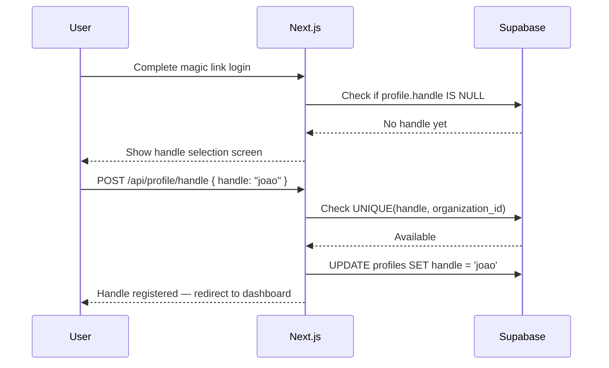
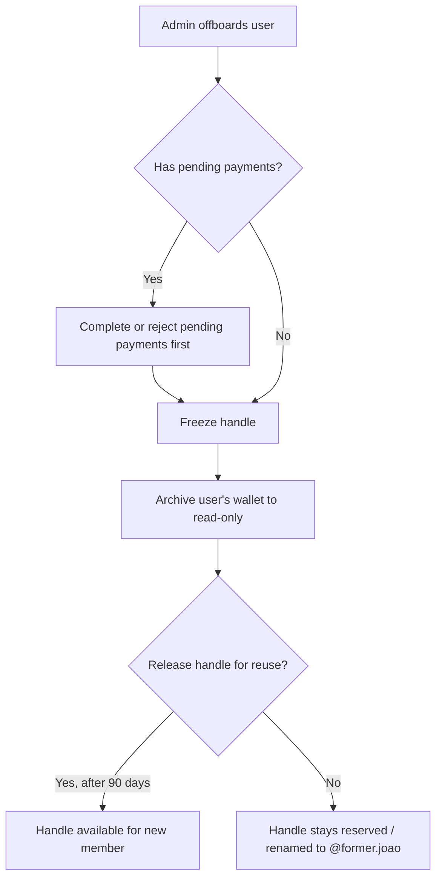

# @Handle System

The @handle system is the core UX innovation of SocialPay. Instead of exchanging Stellar public keys or bank account numbers, users and departments are identified by short, memorable handles scoped to their organization.

---

## What Handles Are

A handle is a human-readable alias for a Stellar public key, scoped to an organization. Handles follow the same conventions as social network usernames:

```
@joao          → GBKXYZ...STELLAR_KEY (individual)
@marketing     → GBKABC...STELLAR_KEY (department)
@ops           → GBKDEF...STELLAR_KEY (department)
@ceo           → GBKGHI...STELLAR_KEY (role-based)
```

When you send to `@marketing`, you are sending to the Stellar account that belongs to the marketing department's shared wallet within your organization — not to any external account.

---

## Handle Format

| Rule | Detail |
|---|---|
| Characters | Lowercase letters (`a-z`), digits (`0-9`), dots (`.`), hyphens (`-`) |
| Length | 3–30 characters |
| Case | Always lowercase; `@Joao` and `@joao` are the same handle |
| Scope | Unique within one organization; not globally unique |
| Prefix | The `@` symbol is a display convention; handles are stored without it |

**Valid handles**
```
@joao
@marketing
@joao.silva
@remote-team
@hr2024
```

**Invalid handles**
```
@jo               — too short (< 3 chars)
@this-handle-is-way-too-long-for-the-system  — too long (> 30 chars)
@João             — uppercase / non-ASCII not allowed
@marketing!       — special character not in allowed set
```

---

## Handle Registration

Handles are chosen during the onboarding flow, after the user confirms their email via magic link.



Handle availability check (client-side, debounced):

```typescript
// hooks/useHandleAvailability.ts
import { useCallback, useState } from 'react';
import { createClient } from '@/lib/supabase-browser';

export function useHandleAvailability(orgId: string) {
  const supabase = createClient();
  const [available, setAvailable] = useState<boolean | null>(null);

  const check = useCallback(async (handle: string) => {
    if (!handle || handle.length < 3) { setAvailable(null); return; }

    const { data } = await supabase
      .from('profiles')
      .select('id')
      .eq('handle', handle.toLowerCase())
      .eq('organization_id', orgId)
      .maybeSingle();

    setAvailable(data === null); // null means no row found = available
  }, [orgId, supabase]);

  return { available, check };
}
```

---

## Handle Resolution

Every payment begins with resolving a handle to a Stellar public key. This is a single indexed query:

```typescript
// lib/handles.ts
import { createClient } from '@/lib/supabase-server';

export interface ResolvedHandle {
  userId: string;
  handle: string;
  displayName: string | null;
  stellarPublicKey: string;
}

export async function resolveHandle(
  handle: string,
  organizationId: string
): Promise<ResolvedHandle | null> {
  const supabase = createClient();

  const { data } = await supabase
    .from('profiles')
    .select('id, handle, display_name, stellar_public_key')
    .eq('handle', handle.toLowerCase().replace('@', ''))
    .eq('organization_id', organizationId)
    .single();

  if (!data || !data.stellar_public_key) return null;

  return {
    userId: data.id,
    handle: data.handle,
    displayName: data.display_name,
    stellarPublicKey: data.stellar_public_key,
  };
}
```

This query is covered by the composite index `(handle, organization_id)` and executes in sub-millisecond time.

---

## Department Handles

Department handles (`@marketing`, `@ops`, `@hr`) map to a shared Stellar wallet rather than an individual user. Multiple org admins can view and manage the department wallet.

```sql
-- profiles table supports a 'type' field
ALTER TABLE profiles ADD COLUMN handle_type text NOT NULL DEFAULT 'user';
-- 'user' | 'department' | 'role'

-- Example department entry
INSERT INTO profiles (id, handle, display_name, stellar_public_key, organization_id, handle_type)
VALUES (
  gen_random_uuid(),
  'marketing',
  'Marketing Team',
  'GBKABC...STELLAR_KEY',
  'org-uuid-here',
  'department'
);
```

Department wallets are managed by admins:

| Admin Action | Result |
|---|---|
| Create department handle | New Stellar account + handle entry in profiles |
| Add manager | organization_member entry with role `department_manager` |
| View balance | Same as personal wallet via `/api/wallet/balance?handle=marketing` |
| Transfer to department | Same as any payment: `@joao → @marketing` |

---

## Handle Search and Autocomplete

When a user types in the "Send to" field, SocialPay provides real-time autocomplete using Supabase full-text search.

```typescript
// app/api/users/search/route.ts
export async function GET(request: Request) {
  const { searchParams } = new URL(request.url);
  const query = searchParams.get('q') ?? '';
  const orgId = searchParams.get('org_id');

  const supabase = createClient();

  const { data } = await supabase
    .from('profiles')
    .select('id, handle, display_name, avatar_url')
    .eq('organization_id', orgId)
    .or(`handle.ilike.%${query}%,display_name.ilike.%${query}%`)
    .order('handle')
    .limit(10);

  return Response.json(data ?? []);
}
```

The autocomplete debounces at 150ms and shows up to 10 results, displaying both the handle and the display name:

```
@joao          João Silva
@joao.costa    João Costa
@jose          José Andrade
```

---

## Handle Transfer (User Leaves Org)

When a user leaves an organization (offboarding), the handle must be handled carefully:



```sql
-- Freeze a handle (admin action)
UPDATE profiles
SET handle = CONCAT('_former.', handle),
    stellar_public_key = NULL  -- wallet archived, no new payments possible
WHERE id = :user_id AND organization_id = :org_id;

-- The wallet record stays intact for historical transaction display
```

Historical transactions always store `sender_handle` and `receiver_handle` as denormalized strings, so the feed correctly shows `@joao` even after the handle is reassigned or archived.

---

## Org-Scoped vs Global Design Decision

SocialPay chose **org-scoped handles** over global handles for several reasons:

**Why not global?**

- A global `@joao` would be claimed by the first João on the platform — creating a land-grab problem
- Different companies legitimately have employees with the same name
- Org-scoped handles make permission boundaries cleaner: you can only send to people in your org (intentional — SocialPay is an *internal* payment tool)
- No need to reserve or squat handles at signup time

**Trade-off: cross-org payments**

The org-scoping decision means you cannot pay `@joao` at another company without knowing their Stellar public key directly. This is addressed in the roadmap.

---

## Future: Cross-Org Payments

The planned format for cross-org payments uses a domain-qualified handle:

```
@joao@acme.socialpay.io
@marketing@beta.socialpay.io
```

This mirrors email address syntax and Stellar's Federation protocol (`joao*acme.socialpay.io`). The resolution would:

1. Parse the handle and domain
2. Fetch the Stellar Federation record for `joao*acme.socialpay.io`
3. Resolve to the target Stellar public key
4. Proceed with a normal payment

This feature is tracked in Phase 5 of the [Roadmap](/doc/ai/socialpay/roadmap).

---

## Handle System Summary

| Property | Value |
|---|---|
| Scope | Per-organization (not global) |
| Uniqueness enforced by | `UNIQUE(handle, organization_id)` DB constraint |
| Resolution latency | Sub-millisecond (indexed query) |
| Supports departments | Yes (shared Stellar account) |
| Autocomplete | Supabase ILIKE search, 150ms debounce |
| Offboarding | Handle frozen then optionally released after 90 days |
| Cross-org payments | Planned via `@handle@org.domain` format |
