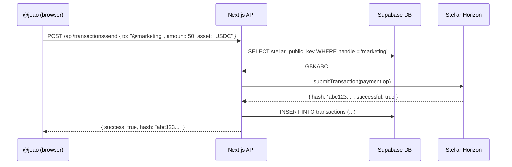

# SocialPay

SocialPay is a corporate internal payment network that lets employees, contractors, and departments send and receive money using human-readable **@handles** instead of bank account numbers, PIX keys, or Stellar public keys.

```
@joao sends $50 to @marketing
```

No IBAN. No PIX key. No 56-character wallet address. Just a handle.

---

## The Problem

Corporate payments are broken for modern organizations:

| Pain Point | Traditional Tools |
|---|---|
| Paying a contractor abroad | Wire transfer, 3–5 days, $15–40 fee |
| Splitting a team expense | Bank transfer requires full IBAN, routing number, branch code |
| Sending to a department budget | No concept of department wallets in banking |
| Paying a remote freelancer in Brazil | PIX only works if both parties have Brazilian CPF |
| Real-time visibility of outflows | Export CSV from bank, import to spreadsheet |
| DAOs paying contributors | Manual crypto wallet address exchange, typo risk |

SocialPay solves all of these at the network layer: one account per person, one handle per identity, one ledger for the entire organization.

---

## How It Works

### The @Handle System

Every user registers with a unique handle within their organization:

```
@joao       → GBKXYZ...STELLAR_PUBLIC_KEY_1
@marketing  → GBKABC...STELLAR_PUBLIC_KEY_2
@ops        → GBKDEF...STELLAR_PUBLIC_KEY_3
```

When `@joao` sends 50 USDC to `@marketing`, the application:

1. Resolves `@marketing` to its Stellar public key via a single database query
2. Signs and submits a Stellar payment transaction server-side (custodial)
3. Records the transaction with visibility metadata (public/org/private)
4. Updates both parties' balances via Horizon API



---

## Target Users

| Segment | Use Case |
|---|---|
| **Companies** | Expense reimbursements, department budgets, contractor pay |
| **DAOs** | Contributor payments, treasury distributions, working group budgets |
| **Remote teams** | Cross-border pay without wire fees, instant settlement |
| **Freelancer collectives** | Client escrow distribution, revenue sharing |
| **NGOs** | Grant disbursement to beneficiaries in emerging markets |

---

## Key Features

| Feature | Description | Status |
|---|---|---|
| **@Handle payments** | Send to `@handle` instead of wallet addresses | Live |
| **Custodial wallets** | One Stellar account per user, keys managed server-side | Live |
| **XLM payments** | Native Stellar Lumens transfers | Live |
| **USDC payments** | Stablecoin transfers on Stellar | In progress |
| **Etherfuse ramp** | BRL/MXN on/off-ramp via PIX and boleto | Live |
| **Transaction feed** | Org-wide payment activity (public/private/org visibility) | Live |
| **x402 analytics** | HTTP 402 payment-gated metrics endpoint | Live |
| **Department handles** | Shared wallets for teams (`@marketing`, `@hr`) | Planned |
| **Supabase Realtime** | Live feed updates without polling | In migration |
| **Magic link auth** | Passwordless via Supabase Auth | In migration |

---

## SGR Ecosystem Integration

SocialPay is one of three products in the **Stellar Global Rails** ecosystem:

```mermaid
graph TD
    SP[SocialPay<br/>@handle payments]
    CE[ContractEase<br/>Smart contracts]
    KP[Kivo Pay<br/>Settlement layer]
    SB[(Supabase<br/>Shared backend)]
    SN[Stellar Network]

    SP --> SB
    CE --> SB
    SP --> KP
    CE --> KP
    KP --> SN
    SP --> SN
```

- **Shared Supabase**: SocialPay and ContractEase share authentication, organization management, and row-level security policies via a unified Supabase project
- **Kivo Pay settlement**: Large or cross-currency transactions are routed through Kivo Pay for optimal path payment execution
- **Stellar Network**: All settlement happens on-chain — SocialPay is a UX layer, not a custodian

---

## Comparison: SocialPay vs Alternatives

| Capability | SocialPay | Bank Transfer | PIX | Crypto Wallet |
|---|---|---|---|---|
| Send to human-readable ID | `@joao` | Full IBAN + branch | CPF/phone/email | 56-char address |
| Settlement time | ~5 seconds | 1–3 business days | Instant (Brazil only) | 5–30 seconds |
| Cross-border | Yes (global) | Yes (high fees) | Brazil only | Yes |
| Department wallets | Yes | No | No | Manual multisig |
| Transaction feed | Yes | Bank export | No | Block explorer |
| Fiat ramp | BRL/MXN | N/A (already fiat) | N/A (already fiat) | CEX required |
| Requires KYC | Org-level | Full banking KYC | CPF required | Often none |
| Programmable | Yes (API) | No | Limited | Yes (complex) |

---

## Quick Start

### 1. Create your organization

```bash
POST /api/organizations
{
  "name": "Acme Corp",
  "slug": "acme"
}
```

### 2. Invite team members

Team members receive a magic link email. On first login, they choose their @handle.

### 3. Fund the wallet

```bash
POST /api/wallet/fund   # testnet (Friendbot)
POST /api/ramp/order    # mainnet (Etherfuse BRL → USDC)
```

### 4. Send a payment

```bash
POST /api/transactions/send
{
  "to": "@marketing",
  "amount": "50",
  "asset": "USDC",
  "description": "Q1 campaign budget",
  "visibility": "org"
}
```

---

## Architecture Summary

- **Frontend**: Next.js App Router (React Server Components + API Routes)
- **Database**: Supabase PostgreSQL with Row Level Security
- **Auth**: Supabase Auth (magic link, JWT)
- **Blockchain**: Stellar Network (custodial, server-side signing)
- **Fiat ramp**: Etherfuse (BRL/MXN anchor, SEP-24)
- **Analytics gate**: x402 protocol
- **Realtime**: Supabase Realtime (transaction feed)

See [Architecture & ADRs](/doc/ai/socialpay/architecture) for full technical decisions.
