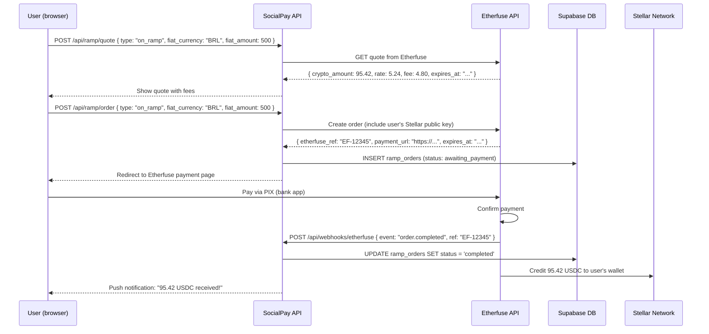
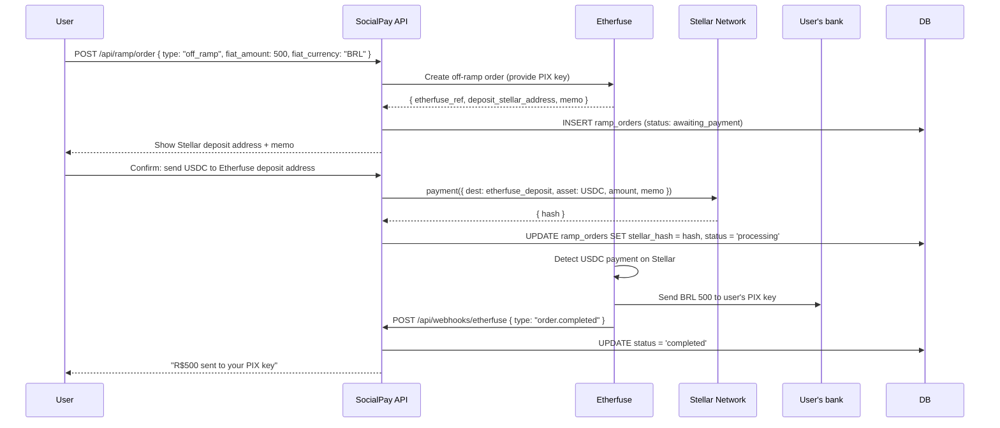
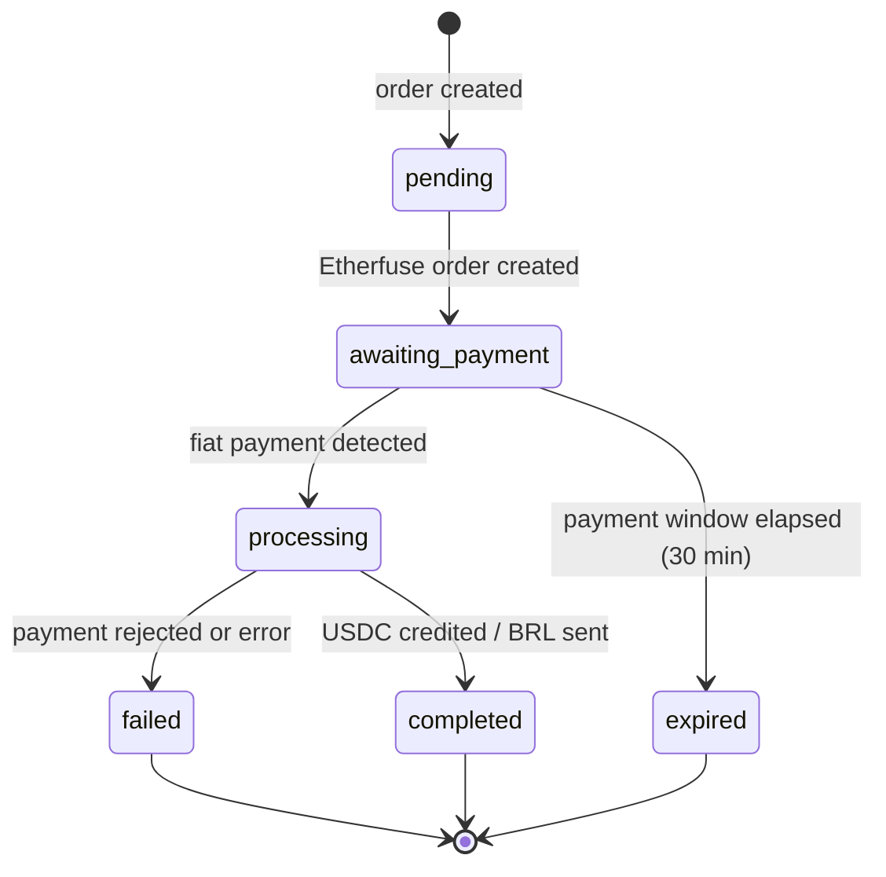

# Fiat On/Off Ramp (Etherfuse)

SocialPay integrates with **Etherfuse** to let users convert between Brazilian Real (BRL), Mexican Peso (MXN), and USDC on the Stellar network. This enables companies to deposit salary in BRL and pay contractors in USDC — and for those contractors to withdraw back to their local bank.

---

## What Is Etherfuse?

Etherfuse is a regulated financial anchor operating in Brazil and Mexico. It is compatible with **Stellar's SEP-24** standard (hosted deposit and withdrawal), which means:

- Users authenticate with Etherfuse via a hosted web interface (no complex API integration from the user's side)
- Deposits are received via PIX (Brazil) or SPEI (Mexico)
- Withdrawals are sent via PIX or SPEI
- Etherfuse credits USDC directly to the user's Stellar account after fiat payment confirmation

SocialPay wraps this flow with its own database tracking and webhook handling to keep the UI updated in real time.

---

## On-Ramp Flow (BRL → USDC)



### Step 1: Get a Quote

```typescript
// Client-side quote fetch
const quoteResponse = await fetch('/api/ramp/quote', {
  method: 'POST',
  headers: { 'Content-Type': 'application/json' },
  body: JSON.stringify({
    type: 'on_ramp',
    fiat_currency: 'BRL',
    fiat_amount: 500,
  }),
});

const quote = await quoteResponse.json();
// {
//   fiat_amount: 500,
//   fiat_currency: "BRL",
//   crypto_amount: 95.42,
//   crypto_asset: "USDC",
//   rate: 5.24,          // BRL per USDC
//   fee_fiat: 4.80,      // Etherfuse spread + Stellar fee
//   fee_crypto: 0.92,
//   expires_at: "2024-01-15T10:05:00Z"
// }
```

### Step 2: Create the Order

```typescript
// app/api/ramp/order/route.ts
export async function POST(request: Request) {
  const supabase = createClient();
  const { data: { user } } = await supabase.auth.getUser();
  if (!user) return Response.json({ error: 'Unauthorized' }, { status: 401 });

  const { type, fiat_currency, fiat_amount } = await request.json();

  // Get user's Stellar public key
  const { data: wallet } = await supabase
    .from('wallets')
    .select('stellar_public_key')
    .eq('user_id', user.id)
    .single();

  // Create order with Etherfuse
  const efOrder = await createEtherfuseOrder({
    type,
    fiat_currency,
    fiat_amount,
    stellar_account: wallet.stellar_public_key,
  });

  // Record in our database
  const { data: order } = await supabase.from('ramp_orders').insert({
    user_id: user.id,
    type,
    fiat_amount,
    fiat_currency,
    crypto_asset: 'USDC',
    status: 'awaiting_payment',
    etherfuse_ref: efOrder.ref,
    payment_url: efOrder.payment_url,
    expires_at: efOrder.expires_at,
  }).select().single();

  return Response.json({
    order_id: order.id,
    etherfuse_ref: order.etherfuse_ref,
    payment_url: order.payment_url,
    expires_at: order.expires_at,
    fiat_amount: order.fiat_amount,
    crypto_amount: efOrder.crypto_amount,
  });
}
```

### Step 3: Webhook Processing

Etherfuse sends a signed webhook when the order status changes. SocialPay verifies the signature and updates the database:

```typescript
// app/api/webhooks/etherfuse/route.ts
import { createHmac, timingSafeEqual } from 'crypto';

export async function POST(request: Request) {
  const rawBody = await request.text();
  const signature = request.headers.get('X-Etherfuse-Signature') ?? '';

  // Verify signature
  const expected = createHmac('sha256', process.env.ETHERFUSE_WEBHOOK_SECRET!)
    .update(rawBody)
    .digest('hex');

  if (!timingSafeEqual(Buffer.from(expected, 'hex'), Buffer.from(signature, 'hex'))) {
    return Response.json({ error: 'Invalid signature' }, { status: 401 });
  }

  const event = JSON.parse(rawBody) as EtherfuseWebhookEvent;
  const supabaseAdmin = createAdminClient();

  switch (event.type) {
    case 'order.completed': {
      await supabaseAdmin.from('ramp_orders')
        .update({
          status: 'completed',
          stellar_hash: event.stellar_hash,
          crypto_amount: event.crypto_amount,
          completed_at: new Date().toISOString(),
        })
        .eq('etherfuse_ref', event.ref);
      break;
    }
    case 'order.failed': {
      await supabaseAdmin.from('ramp_orders')
        .update({ status: 'failed' })
        .eq('etherfuse_ref', event.ref);
      break;
    }
    case 'order.expired': {
      await supabaseAdmin.from('ramp_orders')
        .update({ status: 'expired' })
        .eq('etherfuse_ref', event.ref);
      break;
    }
  }

  return Response.json({ received: true });
}
```

---

## Off-Ramp Flow (USDC → BRL)

The off-ramp is the reverse: the user sends USDC from their Stellar wallet to Etherfuse, and Etherfuse pays out BRL via PIX.



For off-ramps, the user must provide their PIX key (CPF, phone, email, or random key) at the time of order creation. This is stored in the ramp order for reference.

---

## Fee Structure

| Component | On-Ramp | Off-Ramp |
|---|---|---|
| Etherfuse spread | ~1.5% | ~1.5% |
| Stellar transaction fee | ~0.00001 XLM (~$0.001) | ~0.00001 XLM |
| SocialPay platform fee | 0% (free tier) | 0% (free tier) |
| Total estimated fee | ~1.5% | ~1.5% |

Fees are included in the quote response and shown to the user before they confirm the order. The quote is valid for 5 minutes.

---

## Supported Currencies

| Currency | Country | Payment Method | Direction |
|---|---|---|---|
| BRL (Brazilian Real) | Brazil | PIX instant transfer | On-ramp + Off-ramp |
| MXN (Mexican Peso) | Mexico | SPEI bank transfer | On-ramp + Off-ramp |

---

## Order Status Machine



---

## Error States

| Status | Cause | User Action |
|---|---|---|
| `expired` | User did not pay within 30 minutes | Create a new order (rates may have changed) |
| `failed` | Etherfuse could not process payment | Contact support with `etherfuse_ref` |
| `processing` (stuck) | Stellar network congestion | Wait up to 10 minutes; check `stellar_hash` on Stellar Expert |
| Quote rejected | BRL/USDC rate moved past tolerance | Request a new quote |
| Partial payment | User paid less than the order amount | Etherfuse will refund the partial amount; start over |

---

## Future: Direct PIX Integration

The Etherfuse integration adds ~1.5% spread. A future Phase 5 goal is direct integration with the Brazilian Central Bank's Open Finance API or a direct PIX provider, which could reduce fees to ~0.5%. This would require a Brazilian CNPJ and Banco Central registration for SocialPay or its operating entity.
